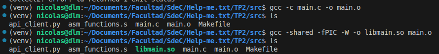
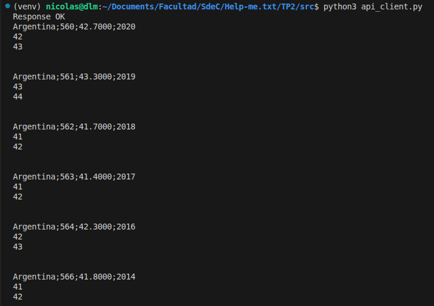

# TP2 — Iteración 1: C con Python 

enlace al repositorio en github: https://github.com/Tuteku/Help-me.txt

## Descripción

En esta primera iteración se implementa la arquitectura de dos capas:

- **Capa superior (Python):** consulta la API REST del Banco Mundial para obtener el índice GINI de Argentina y llama a funciones de C mediante `ctypes`.
- **Capa intermedia (C):** expone las funciones de conversión compiladas como una *shared library* (`.so`), que Python carga dinámicamente.

---

## Capa intermedia — `main.c`

Contiene las dos funciones de conversión:

```c
int float_to_int(float value){
    return (int)value;
}

int add_offset(int value){
    return value + 1;
}
```

- `float_to_int`: convierte el valor GINI (float) a entero por truncamiento.
- `add_offset`: devuelve el índice del país sumando uno (+1).

### Compilación como shared library

Para que Python pueda cargar las funciones mediante `ctypes`, se compila `main.c` como biblioteca de enlace dinámico:

```bash
gcc -shared -fPIC -o libmain.so main.c
```



---

## Capa superior — `api_client.py`

```python
import requests
import sys
import ctypes

lib = ctypes.CDLL("./libmain.so")
lib.float_to_int.argtypes = [ctypes.c_float]
lib.float_to_int.restype = ctypes.c_long
lib.add_offset.argtypes = [ctypes.c_long]
lib.add_offset.restype = ctypes.c_long

URL = "https://api.worldbank.org/v2/en/country/all/indicator/SI.POV.GINI?format=json&date=2011:2020&per_page=32500&page=1&country=%22Argentina%22"

res = requests.get(URL)
if res:
    print('Response OK', file=sys.stderr)
else:
    print('Response Failed', file=sys.stderr)
    sys.exit(1)

data = res.json()
records = data[1]

for idx, entry in enumerate(records):
    value = entry.get("value")
    if value is None or entry["country"]["value"] != "Argentina":
        continue
    country = entry["country"]["value"]
    date = entry["date"]
    print(f"{country};{idx};{float(value):.4f};{date}")
    print(lib.float_to_int(value))
    print(lib.add_offset(lib.float_to_int(value)))
    print("\n")
```

### Funcionamiento

1. Se realiza un `GET` a la API del Banco Mundial con los parámetros del enunciado.
2. Se filtra por país `"Argentina"` y se descartan entradas sin valor.
3. Por cada registro válido:
   - Se imprime la línea con país, índice, valor float y año.
   - Se llama a `lib.float_to_int(value)` → convierte el GINI float a entero (función de C).
   - Se llama a `lib.add_offset(...)` → devuelve el índice compensado en +1 (función de C).

### Carga de la librería con `ctypes`

```python
lib = ctypes.CDLL("./libmain.so")
lib.float_to_int.argtypes = [ctypes.c_float]
lib.float_to_int.restype  = ctypes.c_long
lib.add_offset.argtypes   = [ctypes.c_long]
lib.add_offset.restype    = ctypes.c_long
```

Se declaran explícitamente los tipos de argumentos y retorno para que `ctypes` realice la conversión correcta entre tipos de Python y C.

---

## Ejecución y output

```bash
python3 api_client.py
```



---

## Flujo de llamadas

```
api_client.py
    │
    ├─► requests.get(URL)          # consulta REST API Banco Mundial
    │       └─► filtra Argentina, itera registros
    │
    ├─► lib.float_to_int(value)    # llama función C via ctypes
    │       └─► libmain.so :: float_to_int()  →  (int)value
    │
    └─► lib.add_offset(gini_int)   # llama función C via ctypes
            └─► libmain.so :: add_offset()    →  value + 1
```
