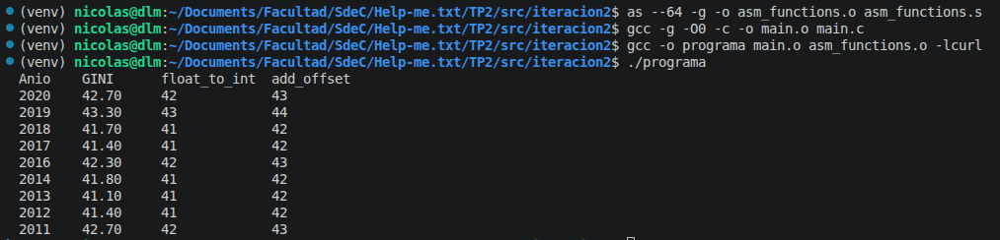
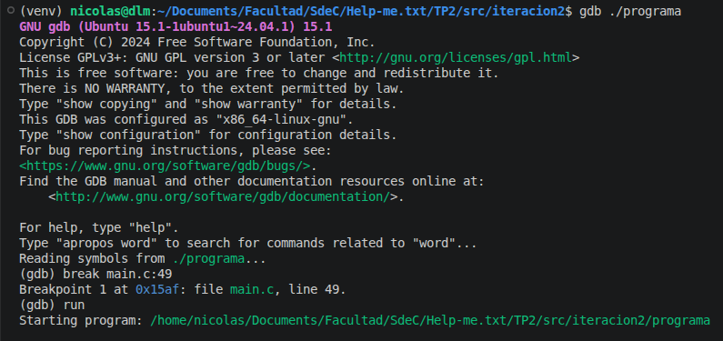
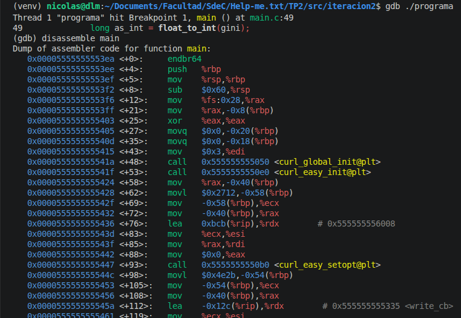
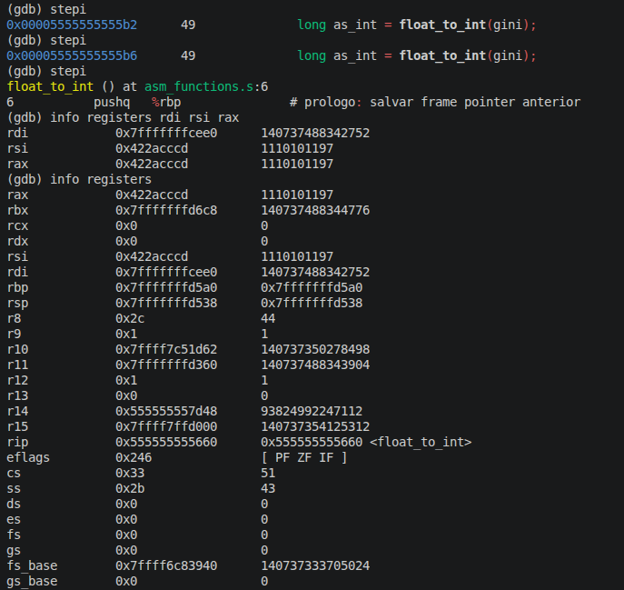
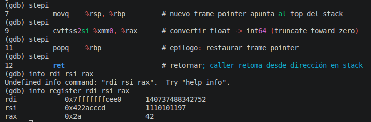

# TP2 — Iteración 2: C con ensamblador y libcurl

enlace al repositorio en github: https://github.com/Tuteku/Help-me.txt

## Descripción

En esta segunda iteración se elimina la capa Python y se integra todo en un único programa C que:

- **Consulta la API REST** del Banco Mundial directamente usando `libcurl`.
- **Parsea la respuesta JSON** de forma manual mediante búsqueda de cadenas.
- **Llama a funciones escritas en ensamblador x86-64** (`asm_functions.s`) en lugar de funciones C.

---

## Funciones de ensamblador — `asm_functions.s`

```asm
    .section .text

    .globl float_to_int 
    .type  float_to_int, @function
float_to_int:
    pushq   %rbp
    movq    %rsp, %rbp
    cvttss2si %xmm0, %rax
    popq    %rbp
    ret

    .globl add_offset
    .type  add_offset, @function
add_offset:
    pushq   %rbp
    movq    %rsp, %rbp
    movq    %rdi, %rax
    addq    %rsi, %rax
    popq    %rbp
    ret

    .section .note.GNU-stack,"",@progbits
```

- `float_to_int`: recibe un `float` en `%xmm0` (convención System V x86-64), lo convierte a entero de 64 bits por truncamiento con `cvttss2si` y retorna en `%rax`.
- `add_offset`: recibe dos `long` en `%rdi` y `%rsi`, retorna su suma en `%rax`.

---

### Funcionamiento

1. `write_cb` acumula los chunks HTTP en un buffer dinámico.
2. Se realiza un `GET` a la API del Banco Mundial filtrando por país `AR` (Argentina) directamente en la URL.
3. Se recorre el JSON buscando pares `"date":"AÑO"` / `"value":NUMERO`.
4. Por cada registro válido (no `null`):
   - `float_to_int(gini)` → convierte el GINI float a entero (función ASM).
   - `add_offset(as_int, 1)` → devuelve el entero sumado en +1 (función ASM).

---

## Compilación manual

```bash
# 1. Ensamblar el archivo .s
as --64 -g -o asm_functions.o asm_functions.s

# 2. Compilar main.c a objeto
gcc -g -O0 -c -o main.o main.c

# 3. Linkear ambos objetos + libcurl
gcc -o programa main.o asm_functions.o -lcurl
```

El flag `-lcurl` es necesario en el paso de linkeo porque las funciones `curl_*` viven en la biblioteca dinámica `libcurl`. Sin él el linker lanza `undefined reference`.

---

## Ejecución y output

```bash
./programa
```



---

## Depuración con GDB: estado del stack en tres fases

Se compila con `-g -O0` y se depura con `gdb ./programa` usando GDB Dashboard para ver registros, stack y fuente en simultáneo. Se colocan breakpoints en `main.c` (línea de la llamada a `float_to_int`) y en `float_to_int` (entrada de la función).

Comandos de inspección utilizados en cada fase:

```bash
info registers rsp rbp rax
x/8xg $rsp
disassemble
```

### Fase 1 — Antes de la llamada



- `%rsp` y `%rbp` corresponden al frame de `main`.
- El argumento `gini` (float) viaja por `%xmm0` según la ABI System V AMD64 (los floats no usan `%rdi`).
- Aún no se apiló la dirección de retorno: la cima del stack todavía pertenece a las variables locales de `main`.
- `%rax` contiene basura previa; todavía no hubo retorno.

### Fase 2 — Durante la ejecución 




- El `call` apiló la dirección de retorno (`%rsp -= 8`) y saltó a la función.
- El prólogo ejecutó `pushq %rbp` (baja `%rsp` otros 8 bytes) y `movq %rsp, %rbp`, creando el stack frame propio.
- Desde el nuevo `%rbp` el mapa del stack queda así:
  - `0x0(%rbp)`  → valor anterior de `%rbp` (ancla del frame de `main`).
  - `0x8(%rbp)`  → dirección de retorno a `main`.
- `cvttss2si %xmm0, %rax` hace la conversión por truncamiento y deja el entero en `%rax` listo para retornar.
- Notar que `float_to_int` no consume espacio extra del stack: sólo preserva `%rbp`.

### Fase 3 — Después del `ret` 


- El epílogo ejecutó `popq %rbp` (restaura el `%rbp` de `main`) y `ret` (desapila la dirección de retorno y salta).
- `%rsp` y `%rbp` vuelven al estado exacto de la Fase 1.
- `%rax` ahora contiene el entero truncado (valor de retorno), que `main` lee y asigna a `as_int`.
- Inmediatamente después `main` prepara `%rdi = as_int`, `%rsi = 1` y llama a `add_offset`, cuyo retorno (también en `%rax`) queda en `with_offset`.

---

## Flujo de llamadas

```
main.c
    │
    ├─► curl_easy_perform()        # GET a la API del Banco Mundial
    │       └─► write_cb()         # acumula respuesta JSON en buffer
    │
    ├─► strstr / sscanf            # parseo manual del JSON
    │       └─► extrae año y valor GINI por cada registro
    │
    ├─► float_to_int(gini)         # llama función ASM
    │       └─► asm_functions.s :: cvttss2si  →  (long)gini
    │
    └─► add_offset(as_int, 1)      # llama función ASM
            └─► asm_functions.s :: addq       →  as_int + 1
```
