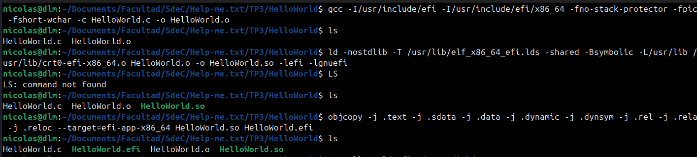

# Informe TP3-a — Sistemas de Computación

### Help-me.txt
Integrantes: 
- Mauro Cabero
- Nicolas de la Mata
- Mateo Quispe

Enlace al repositorio en github: https://github.com/Tuteku/Help-me.txt
## Introducción

<a name="_page2_x70.87_y70.87"></a>El objetivo de este trabajo práctico es compilar, ejecutar y depurar una aplicación UEFI personalizada (Hello World) dentro de un entorno virtualizado con QEMU. Para ello se utiliza el framework GNU-EFI y el firmware OVMF, siguiendo como referencia las lecciones del repositorio UEFI-Lessons de Javier Borlenghi.

**Cuestionario<a name="_page2_x70.87_y165.38"></a> de Análisis y Desarrollo (Q&A)** 

¿Dónde se ubica nuestra aplicación en el flujo UEFI?

Cuando el firmware UEFI arranca, pasa por las fases definidas por la especificación Platform Initialization (PI): SEC, PEI, DXE y BDS. Nuestra aplicación es.efi una UEFI Applic queation se carga durante la fase BDS (Boot Device Selection). En esta fase, el firmware ya ha inicializado

la memoria, los buses y los servicios centrales; por lo tanto, cuando nuestro efi\_main recibe

el puntero a la EFI\_SYSTEM\_TABLE, todos los Boot Services (gestión de memoria, protocolos, eventos) ya están disponibles para ser consumidos.

El ejecutable .efi utiliza el formato PE/COFF (PE32+), que es el estándar que la es- pecificación UEFI exige para todas las imágenes ejecutables. Esto explica por qué el proceso de compilación incluye una conversión explícita de ELF a PE32+ mediante objc .opy

1. Al ejecutar los comandos map y dh, se observan protocolos e identificadores en lugar de direcciones de E/S fijas. ¿Qué ventajas en términos de seguridad y compatibilidad ofrece este modelo respecto al BIOS tradicional?

   El paso de un modelo basado en puertos de hardware fijos a uno basado en Protocolos e Instancias de Handles ofrece mejoras críticas:

- Seguridad: Se establece una capa de abstracción que impide el acceso directo y arbitrario a los registros del hardware. Al interactuar mediante interfaces definidas (protocolos), se limita el radio de acción de código malicioso, evitando que este manipule registros críticos fuera de su ámbito de ejecución.
- Compatibilidad: La abstracción permite que las aplicaciones EFI sean independientes del hardware subyacente. Un desarrollador puede escribir código que interactúe con un bloque de almacenamiento o una interfaz de red sin conocer los detalles específicos del controlador, facilitando la interoperabilidad entre distintos fabricantes y generaciones de hardware.
2. Considerando las variables Boot#### y BootOrder, ¿cuál es el mecanismo que utiliza el Boot Manager para establecer la secuencia de arranque?

   El Boot Manager opera mediante una estructura de prioridades definida en variables de entorno no volátiles (NVRAM):

- Cada variable Boot#### contiene una carga útil (load option) que apunta a un dispositivo físico y una ruta de archivo específica del cargador de arranque.
- La variable BootOrder contiene un arreglo de índices que dicta la jerarquía de ejecución. El firmware recorre esta lista secuencialmente, intentando cargar cada opción hasta que una de ellas se ejecute con éxito (EFI\_SUCCESS).
3. En el mapa de memoria (memmap), ¿por qué las regiones categorizadas como RuntimeServicesCode representan un vector de ataque crítico para el desarrollo de Bootkits?

   Las regiones RuntimeServicesCode son altamente vulnerables y codiciadas por el malware de tipo Bootkit debido a su persistencia:

- A diferencia de los BootServices, que se liberan mediante la función ExitBootServi ,ces() los servicios de runtime permanecen en memoria después de que el sistema operativo ha tomado el control.
- Esto permite que el código malicioso se ejecute con los máximos privilegios del procesa- dor (Ring -2), invisibilizando su presencia ante soluciones de seguridad del SO (antivirus) y garantizando persistencia absoluta incluso tras reinicios del sistema.
4. ¿Cuál es la razón técnica para utilizar SystemTable->ConOut->OutputString en lugar de la función estándar printf() de C durante el desarrollo en UEFI?

   La ausencia de la función printf() se debe a que, en el entorno bare-metal de UEFI, no existe una biblioteca estándar de C (libc) ni un sistema operativo que gestione los descriptores de archivos.

- printf() es una función de alto nivel que requiere un sistema de soporte subyacente para el flujo de salida.
- OutputString es un método del protocolo EFI\_SIMPLE\_TEXT\_OUTPUT\_PROTOCOL, propor- cionado directamente por el firmware. Es la interfaz nativa y disponible para enviar datos

  a la consola de salida antes de que cualquier sistema operativo sea cargado.

5. En herramientas de ingeniería inversa como Ghidra, el valor hexadecimal 0xCC suele interpretarse como -52. ¿Por qué ocurre esto y cuál es su relevancia en el ámbito de la ciberseguridad?

Este fenómeno es una consecuencia de la interpretación de tipos de datos en la descompilación:

- El valor 0xCC en binario es 11001100. Si el descompilador interpreta este byte como un entero de 8 bits con signo (signed char), el bit más significativo indica un valor negativo en complemento a dos, resultando en .-52
- En ciberseguridad, 0xCC es la instrucción INT 3 (punto de interrupción) en arquitecturas x86. Es fundamental reconocer que un mismo patrón de bytes puede ser visualizado de distintas formas según el casting. Ignorar esto podría llevar a analistas a omitir firmas de detección (como reglas YARA) o a malinterpretar técnicas de anti-debugging integradas en el binario.
## 1. Instalacion del toolkit GNU-EFI

Para poder compilar y ejecutar un archivo .efi personalizado, en este caso un programa que muestre un hello world, existe la posibilidad de utilizar tanto el framework EDK II o GNU-EFI. Elegimos GNU-EFI porque es mas sencilla su instalacion (disponible en apt) y mas simple para esta tarea.


**Codigo implementado en C para mostrar el hello world**

```c
#include <efi.h>
#include <efilib.h>

EFI_STATUS
EFIAPI
efi_main(EFI_HANDLE ImageHandle, EFI_SYSTEM_TABLE *SystemTable)
{
    InitializeLib(ImageHandle, SystemTable);
    Print(L"Hello World!\n");
    return EFI_SUCCESS;
}
```
**Análisis de la firma de efi_main:**

- EFI_HANDLE ImageHandle: Es el handle que identifica a nuestra propia imagen cargada en la base de datos de handles del firmware. A través de él podemos consultar protocolos asociados a nuestro ejecutable (como EFI_LOADED_IMAGE_PROTOCOL).
- EFI_SYSTEM_TABLE *SystemTable: Es el puntero a la estructura central de UEFI. Contiene los punteros a Boot Services, Runtime Services, y las consolas de entrada/salida. Es el equivalente al "entry point" del entorno UEFI para cualquier aplicación.
- InitializeLib(): Función de GNU-EFI que almacena internamente los punteros a la System Table y a los Boot Services, permitiendo que funciones de conveniencia como Print() funcionen sin pasar la tabla explícitamente.

## 2. Proceso de compilación

La generación del `.efi` se realiza en tres etapas: compilación, linkeo y conversión de formato.

### 2.1 Etapa 1: compilación del objeto (`.c` → `.o`)

```bash
gcc -I/usr/include/efi -I/usr/include/efi/x86_64 -fno-stack-protector -fpic -fshort-wchar -c HelloWorld.c -o HelloWorld.o
```

| Flag | Descripción |
|------|-------------|
| `-I/usr/include/efi` | Agrega el directorio de headers de gnu-efi al path de búsqueda, donde se encuentran `efi.h` y `efilib.h` |
| `-I/usr/include/efi/x86_64` | Incluye los headers específicos de la arquitectura x86-64, que definen los tipos como `EFI_HANDLE` y `EFI_SYSTEM_TABLE` |
| `-fno-stack-protector` | Desactiva el canary de stack. El protector inserta llamadas a `__stack_chk_fail` que pertenece a la libc, la cual no existe en el entorno UEFI |
| `-fpic` | Genera código independiente de posición (Position Independent Code). Necesario porque el `.efi` puede ser cargado en cualquier dirección de memoria |
| `-fshort-wchar` | Hace que `wchar_t` mida 2 bytes en vez de 4. UEFI usa UTF-16 (2 bytes por carácter), mientras que en Linux por defecto es de 4 bytes |
| `-c` | Compila sin linkear, generando el archivo objeto `.o` |

### 2.2 Etapa 2: linkeo (`.o` → `.so`)

```bash
ld -nostdlib -T /usr/lib/elf_x86_64_efi.lds -shared -Bsymbolic -L/usr/lib /usr/lib/crt0-efi-x86_64.o HelloWorld.o -o HelloWorld.so -lefi -lgnuefi
```

| Flag | Descripción |
|------|-------------|
| `-nostdlib` | No linkea la librería estándar de C. En UEFI no existe libc |
| `-T /usr/lib/elf_x86_64_efi.lds` | Usa el linker script de gnu-efi, que define el orden y alineación de las secciones del ejecutable para que sean compatibles con UEFI |
| `-shared` | Genera un objeto compartido (`.so`), paso intermedio antes de convertir a `.efi` |
| `-Bsymbolic` | Resuelve las referencias a símbolos propios directamente, sin pasar por la GOT (Global Offset Table) |
| `/usr/lib/crt0-efi-x86_64.o` | Objeto de startup de gnu-efi: es el entry point del `.efi`, que inicializa el entorno y luego llama a nuestra función `efi_main` |
| `-L/usr/lib` | Indica el directorio donde buscar las librerías `-lefi` y `-lgnuefi` |
| `-lefi` | Librería con los tipos y definiciones del estándar UEFI |
| `-lgnuefi` | Librería de gnu-efi que provee funciones de alto nivel como `InitializeLib` y `Print` |

### 2.3 Etapa 3: conversión de formato (`.so` → `.efi`)

```bash
objcopy -j .text -j .sdata -j .data -j .dynamic -j .dynsym -j .rel -j .rela -j .reloc --target=efi-app-x86_64 HelloWorld.so HelloWorld.efi
```

El ELF generado por el linker contiene información que UEFI no entiende (tabla de secciones ELF, símbolos de debug, etc.). `objcopy` extrae solo las secciones necesarias y las reempaqueta en formato PE32+, que es el formato de ejecutable que el firmware UEFI puede cargar y ejecutar.

| Flag | Descripción |
|------|-------------|
| `-j .text` | Copia la sección de código ejecutable |
| `-j .sdata` | Copia los datos pequeños (small data) |
| `-j .data` | Copia los datos inicializados |
| `-j .dynamic` | Copia la información de linking dinámico, necesaria para resolver relocaciones en tiempo de carga |
| `-j .dynsym` | Copia la tabla de símbolos dinámicos |
| `-j .rel` / `-j .rela` | Copia las tablas de relocaciones en formato ELF |
| `-j .reloc` | Copia las relocaciones en formato PE/COFF, que UEFI usa para reubicar el ejecutable en memoria |
| `--target=efi-app-x86_64` | Convierte el formato de salida de ELF a PE32+ (aplicación UEFI para x86-64) |



## Explorando Shell UEFI
### Exploracion de dispositivos (handles y protocolos)


## 3. Ejecución en QEMU

Para correr el `.efi` se necesita un firmware UEFI (OVMF) y un disco FAT donde esté el ejecutable. QEMU permite exponer un directorio local directamente como disco FAT sin necesidad de crear ni formatear una imagen:

```bash
mkdir ~/UEFI_disk
cp HelloWorld.efi ~/UEFI_disk/
```


Una vez en el shell UEFI se navega al filesystem y se ejecuta el binario:


## 4. Depuración de ejecutables con llamadas a BIOS

Al iniciar la depuración se debe utilizar el programa `qemu` para lanzar la imagen con unas flags las cuales permiten su debugeo desde el `gdb`. El comando para la compilación es el siguiente:
```bash
qemu-system-x86_64 -fda main.img -boot a -s -S -monitor stdio
```

Luego se debe abrir desde otra terminal el `gdb` y utilizar el comando `target remote localhost:1234` para poder debugear desde la terminal con `gdb` el programa en asm:


"Una vez iniciada la sesión en GDB, se establecen dos puntos de interrupción en las direcciones de memoria 0x7c00 y 0x7c0c:"


Con estos breakpoints colocados estratégicamente logramos ir mediante la instrucción “continue” en gdb ir avanzando e ir viendo la impresión de a una letra por vez en la consola de qemu.


