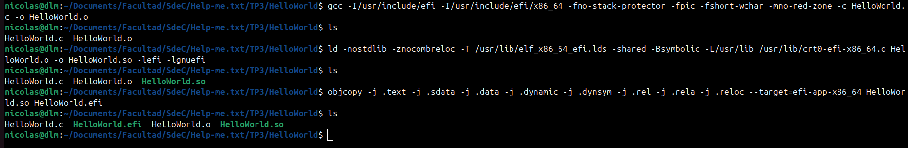
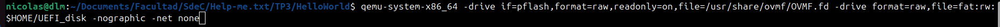
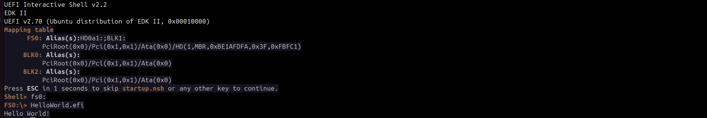
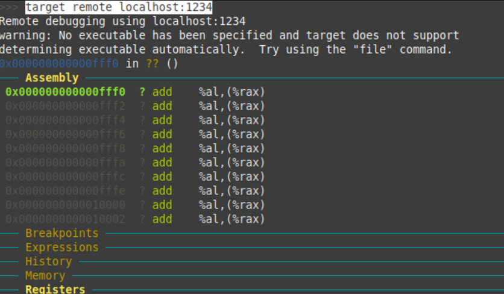
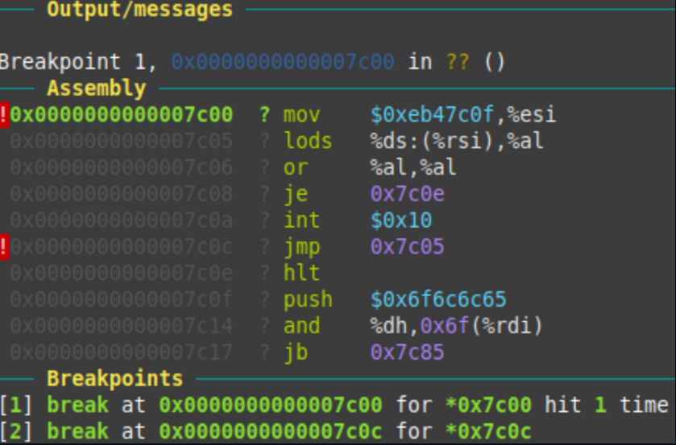
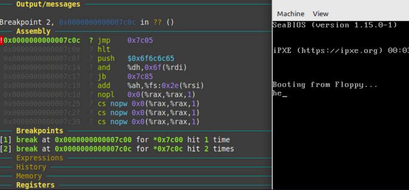

# Informe TP3-a — Sistemas de Computación

### Help-me.txt
Integrantes: 
- Mauro Cabero
- Nicolas de la Mata
- Mateo Quispe

Enlace al repositorio en github: https://github.com/Tuteku/Help-me.txt
## Introducción
El objetivo de este trabajo práctico es compilar, ejecutar y depurar una aplicación UEFI personalizada (Hello World) dentro de un entorno virtualizado con QEMU. Para ello se utiliza el framework GNU-EFI y el firmware OVMF, siguiendo como referencia las lecciones del repositorio UEFI-Lessons de Javier Borlenghi.
### ¿Dónde se ubica nuestra aplicación en el flujo UEFI?
Cuando el firmware UEFI arranca, pasa por las fases definidas por la especificación Platform Initialization (PI): SEC, PEI, DXE y BDS. Nuestra aplicación .efi es una UEFI Application que se carga durante la fase BDS (Boot Device Selection). En esta fase, el firmware ya ha inicializado la memoria, los buses y los servicios centrales; por lo tanto, cuando nuestro efi_main recibe el puntero a la EFI_SYSTEM_TABLE, todos los Boot Services (gestión de memoria, protocolos, eventos) ya están disponibles para ser consumidos.
El ejecutable .efi utiliza el formato PE/COFF (PE32+), que es el estándar que la especificación UEFI exige para todas las imágenes ejecutables. Esto explica por qué el proceso de compilación incluye una conversión explícita de ELF a PE32+ mediante objcopy.
## 1. Instalacion del toolkit GNU-EFI

Para poder compilar y ejecutar un archivo .efi personalizado, en este caso un programa que muestre un hello world, existe la posibilidad de utilizar tanto el framework EDK II o GNU-EFI. Elegimos GNU-EFI porque es mas sencilla su instalacion (disponible en apt) y mas simple para esta tarea.


**Codigo implementado en C para mostrar el hello world**

```c
#include <efi.h>
#include <efilib.h>

EFI_STATUS
EFIAPI
efi_main(EFI_HANDLE ImageHandle, EFI_SYSTEM_TABLE *SystemTable)
{
    InitializeLib(ImageHandle, SystemTable);
    Print(L"Hello World!\n");
    return EFI_SUCCESS;
}
```
**Análisis de la firma de efi_main:**

- EFI_HANDLE ImageHandle: Es el handle que identifica a nuestra propia imagen cargada en la base de datos de handles del firmware. A través de él podemos consultar protocolos asociados a nuestro ejecutable (como EFI_LOADED_IMAGE_PROTOCOL).
- EFI_SYSTEM_TABLE *SystemTable: Es el puntero a la estructura central de UEFI. Contiene los punteros a Boot Services, Runtime Services, y las consolas de entrada/salida. Es el equivalente al "entry point" del entorno UEFI para cualquier aplicación.
- InitializeLib(): Función de GNU-EFI que almacena internamente los punteros a la System Table y a los Boot Services, permitiendo que funciones de conveniencia como Print() funcionen sin pasar la tabla explícitamente.

## 2. Proceso de compilación

La generación del `.efi` se realiza en tres etapas: compilación, linkeo y conversión de formato.

### 2.1 Etapa 1: compilación del objeto (`.c` → `.o`)

```bash
gcc -I/usr/include/efi -I/usr/include/efi/x86_64 \
    -fno-stack-protector -fpic -fshort-wchar -mno-red-zone \
    -c HelloWorld.c -o HelloWorld.o
```

| Flag | Descripción |
|------|-------------|
| `-I/usr/include/efi` | Agrega el directorio de headers de gnu-efi al path de búsqueda, donde se encuentran `efi.h` y `efilib.h` |
| `-I/usr/include/efi/x86_64` | Incluye los headers específicos de la arquitectura x86-64, que definen los tipos como `EFI_HANDLE` y `EFI_SYSTEM_TABLE` |
| `-fno-stack-protector` | Desactiva el canary de stack. El protector inserta llamadas a `__stack_chk_fail` que pertenece a la libc, la cual no existe en el entorno UEFI |
| `-fpic` | Genera código independiente de posición (Position Independent Code). Necesario porque el `.efi` puede ser cargado en cualquier dirección de memoria |
| `-fshort-wchar` | Hace que `wchar_t` mida 2 bytes en vez de 4. UEFI usa UTF-16 (2 bytes por carácter), mientras que en Linux por defecto es de 4 bytes |
| `-mno-red-zone` | Desactiva la red zone de x86-64. La ABI de Linux reserva 128 bytes por debajo de `%rsp` como área temporal, pero las interrupciones de UEFI pueden pisarla, lo que causaría corrupción de datos |
| `-c` | Compila sin linkear, generando el archivo objeto `.o` |

### 2.2 Etapa 2: linkeo (`.o` → `.so`)

```bash
ld -nostdlib -znocombreloc \
   -T /usr/lib/elf_x86_64_efi.lds \
   -shared -Bsymbolic \
   -L/usr/lib /usr/lib/crt0-efi-x86_64.o \
   HelloWorld.o -o HelloWorld.so -lefi -lgnuefi
```

| Flag | Descripción |
|------|-------------|
| `-nostdlib` | No linkea la librería estándar de C. En UEFI no existe libc |
| `-znocombreloc` | Impide combinar relocaciones de tipo relativo, necesario para que el formato PE/COFF resultante sea válido |
| `-T /usr/lib/elf_x86_64_efi.lds` | Usa el linker script de gnu-efi, que define el orden y alineación de las secciones del ejecutable para que sean compatibles con UEFI |
| `-shared` | Genera un objeto compartido (`.so`), paso intermedio antes de convertir a `.efi` |
| `-Bsymbolic` | Resuelve las referencias a símbolos propios directamente, sin pasar por la GOT (Global Offset Table) |
| `/usr/lib/crt0-efi-x86_64.o` | Objeto de startup de gnu-efi: es el entry point del `.efi`, que inicializa el entorno y luego llama a nuestra función `efi_main` |
| `-L/usr/lib` | Indica el directorio donde buscar las librerías `-lefi` y `-lgnuefi` |
| `-lefi` | Librería con los tipos y definiciones del estándar UEFI |
| `-lgnuefi` | Librería de gnu-efi que provee funciones de alto nivel como `InitializeLib` y `Print` |

### 2.3 Etapa 3: conversión de formato (`.so` → `.efi`)

```bash
objcopy -j .text -j .sdata -j .data -j .dynamic \
        -j .dynsym -j .rel -j .rela -j .reloc \
        --target=efi-app-x86_64 HelloWorld.so HelloWorld.efi
```

El ELF generado por el linker contiene información que UEFI no entiende (tabla de secciones ELF, símbolos de debug, etc.). `objcopy` extrae solo las secciones necesarias y las reempaqueta en formato PE32+, que es el formato de ejecutable que el firmware UEFI puede cargar y ejecutar.

| Flag | Descripción |
|------|-------------|
| `-j .text` | Copia la sección de código ejecutable |
| `-j .sdata` | Copia los datos pequeños (small data) |
| `-j .data` | Copia los datos inicializados |
| `-j .dynamic` | Copia la información de linking dinámico, necesaria para resolver relocaciones en tiempo de carga |
| `-j .dynsym` | Copia la tabla de símbolos dinámicos |
| `-j .rel` / `-j .rela` | Copia las tablas de relocaciones en formato ELF |
| `-j .reloc` | Copia las relocaciones en formato PE/COFF, que UEFI usa para reubicar el ejecutable en memoria |
| `--target=efi-app-x86_64` | Convierte el formato de salida de ELF a PE32+ (aplicación UEFI para x86-64) |



## 3. Ejecución en QEMU

Para correr el `.efi` se necesita un firmware UEFI (OVMF) y un disco FAT donde esté el ejecutable. QEMU permite exponer un directorio local directamente como disco FAT sin necesidad de crear ni formatear una imagen:

```bash
mkdir ~/UEFI_disk
cp HelloWorld.efi ~/UEFI_disk/
```


Una vez en el shell UEFI se navega al filesystem y se ejecuta el binario:




## 4. Depuración de ejecutables con llamadas a BIOS

Al iniciar la depuración se debe utilizar el programa `qemu` para lanzar la imagen con unas flags las cuales permiten su debugeo desde el `gdb`. El comando para la compilación es el siguiente:
```bash
qemu-system-x86_64 -fda main.img -boot a -s -S -monitor stdio
```

Luego se debe abrir desde otra terminal el `gdb` y utilizar el comando `target remote localhost:1234` para poder debugear desde la terminal con `gdb` el programa en asm:


"Una vez iniciada la sesión en GDB, se establecen dos puntos de interrupción en las direcciones de memoria 0x7c00 y 0x7c0c:"


Con estos breakpoints colocados estratégicamente logramos ir mediante la instrucción “continue” en gdb ir avanzando e ir viendo la impresión de a una letra por vez en la consola de qemu.


