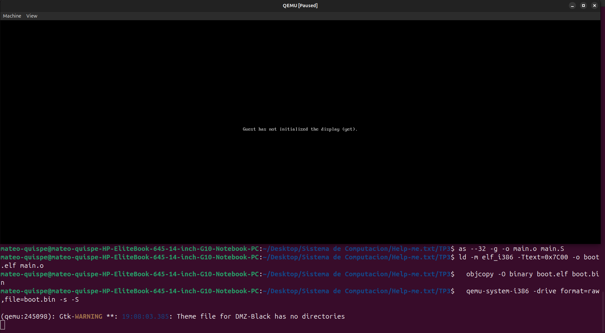
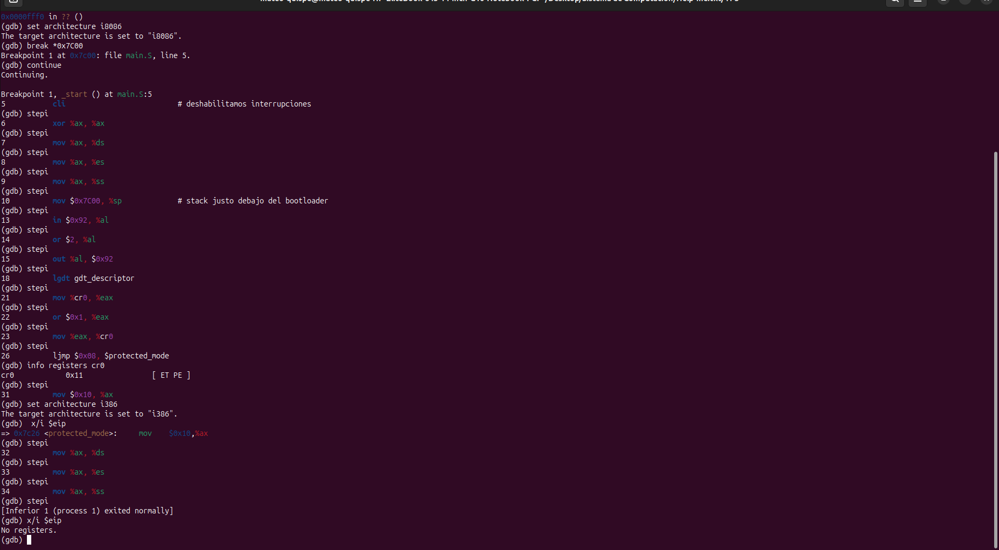
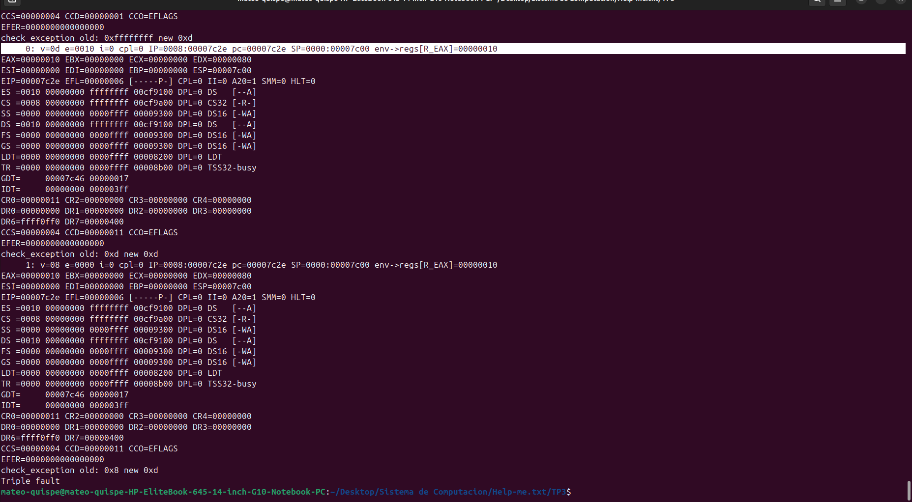

# Informe TP3 — Sistemas de Computación

### Help-me.txt
Integrantes: 
- Mauro Cabero
- Nicolas de la Mata
- Mateo Quispe

Enlace al repositorio en github: https://github.com/Tuteku/Help-me.txt

## 1. Firmware moderno: UEFI, CSME, MEBx y coreboot

### 1.1 ¿Qué es UEFI?

UEFI (*Unified Extensible Firmware Interface*) es la interfaz de firmware moderna que reemplazó al BIOS clásico que veníamos arrastrando desde los años 80. En la práctica, es el primer software que corre cuando uno enciende la computadora: se encarga de inicializar el hardware (procesador, memoria, controladoras de disco, USB, red), elegir un dispositivo de arranque y entregarle el control al sistema operativo.

A diferencia del BIOS tradicional, UEFI:

- Funciona en modo protegido o de 64 bits desde el arranque, no en modo real de 16 bits.
- Tiene un cargador de arranque por archivo (`.efi`) en una partición FAT especial llamada **EFI System Partition (ESP)**, en lugar de depender del MBR.
- Soporta discos GPT, lo que permite particiones mayores a 2 TB y más de 4 particiones primarias.
- Incluye **Secure Boot**, que verifica firmas digitales de los bootloaders antes de ejecutarlos.
- Expone una API estandarizada (servicios de arranque y servicios de runtime) que el sistema operativo puede usar.

### 1.2 ¿Cómo puedo usarlo?

UEFI define dos tipos de servicios accesibles mediante una tabla llamada `EFI_SYSTEM_TABLE`, que el firmware le pasa al programa al arrancar:

- **Boot Services:** disponibles solo hasta que el SO toma el control (`ExitBootServices`).
- **Runtime Services:** siguen disponibles incluso después de que el sistema operativo arrancó (por ejemplo, para leer/escribir variables NVRAM o reiniciar la máquina).

Para usarlo como desarrollador, lo habitual es escribir una **aplicación EFI** en C usando un toolkit como **GNU-EFI** o **EDK II**. Ejemplo codigo c:

```c
#include <efi.h>
#include <efilib.h>

EFI_STATUS efi_main(EFI_HANDLE ImageHandle, EFI_SYSTEM_TABLE *SystemTable) {
    InitializeLib(ImageHandle, SystemTable);
    Print(L"Hola desde UEFI!\n");
    return EFI_SUCCESS;
}
```

Implementación en Hardware Real:

- Formatear una memoria USB en FAT32 ya que el firmware UEFI solo puede leer sistemas de archivos FAT32.
- Crear la estructura de directorios /EFI/BOOT/.
- Renombrar el ejecutable a bootx64.efi y ponerlo en esa carpeta.
- Entrar a la BIOS/UEFI del equipo y seleccionar USB como primera opción de arranque.

### 1.3 Una función llamable bajo esa dinámica

Un ejemplo concreto: la función `OutputString` del protocolo `EFI_SIMPLE_TEXT_OUTPUT_PROTOCOL`, que permite imprimir texto por consola sin tener todavía un sistema operativo:

```c
SystemTable->ConOut->OutputString(SystemTable->ConOut, L"Texto en pantalla\n");
```

### 1.4 Casos de bugs de UEFI explotables

UEFI corre con privilegios máximos y persiste en flash, así que un bug acá es prácticamente un *rootkit* permanente. Algunos casos famosos:

- **LoJax (2018):** primer rootkit UEFI detectado *in the wild*, atribuido al grupo APT28. Modificaba el módulo SPI flash para sobrevivir reinstalaciones del SO y reemplazos de disco.
- **MosaicRegressor (2020):** implante UEFI descubierto por Kaspersky, basado en código filtrado de Hacking Team.
- **BootHole (CVE-2020-10713):** vulnerabilidad de buffer overflow en el parser de `grub.cfg` de GRUB2 que permitía saltar Secure Boot.
- **Logofail (2023):** familia de bugs en los parsers de imágenes (BMP, PNG, GIF) usados por el firmware para mostrar el logo del fabricante. Un logo malicioso embebido en la ESP ejecutaba código durante el arranque, antes incluso del SO.
- **PixieFail (2024):** nueve vulnerabilidades en la pila de red TCP/IPv6 de EDK II que permitían RCE durante un PXE boot.
- **BlackLotus (2023):** primer bootkit UEFI capaz de saltar Secure Boot incluso en Windows 11 actualizado, vendido en foros clandestinos.

El patrón común es que muchos de estos bugs son errores de validación, donde el firmware confía en datos que en realidad pueden venir de un atacante.

### 1.5 CSME e Intel MEBx

**Converged Security and Management Engine (CSME)** es un subsistema autónomo dentro de los chipsets Intel modernos. Es básicamente una computadora dentro de la computadora: tiene su propia CPU (un núcleo Quark/Minute IA), su propia RAM, su propio firmware, y corre incluso cuando la máquina está apagada (mientras tenga corriente). Se encarga de:

- Funciones de seguridad de plataforma (raíz de confianza, fTPM, EPID para DRM).
- **Intel AMT (Active Management Technology)**, que permite a un administrador acceder remotamente a la máquina aunque el SO esté caído.
- Boot Guard, BIOS Guard y verificación de firmware.

**Intel MEBx (Management Engine BIOS Extension)** es una pantalla de configuración accesible desde el firmware UEFI/BIOS que permite configurar AMT/CSME: contraseña del ME, redes administrativas, certificados, modo de aprovisionamiento, etc. Es la "puerta de entrada" desde el firmware para administrar el motor de gestión.

### 1.6 ¿Qué es coreboot?

**coreboot** es un firmware libre y open source que reemplaza al BIOS/UEFI. Su filosofía es: hacer **lo mínimo indispensable** para inicializar el hardware (memoria, CPU, buses) y luego saltar lo más rápido posible a un *payload* — que puede ser un kernel Linux, GRUB, etc.

#### Productos que lo incorporan

- **Chromebooks / ChromeOS devices:** prácticamente todos los Chromebook usan coreboot desde fábrica.
- **System76:** sus laptops Galago Pro, Darter Pro, Lemur Pro vienen con coreboot.
- **Servidores OCP (Open Compute Project)** de Facebook/Meta y otros hyperscalers.

#### Ventajas de su utilización

- **Tiempo de arranque mucho menor:** al hacer solo lo necesario, puede arrancar a Linux en menos de 1 segundo.
- **Código auditable:** al ser open source, se puede inspeccionar y verificar — clave en escenarios de seguridad y soberanía.
- **Personalización:** uno puede elegir el payload, sacar funciones que no usa, ajustar el comportamiento del arranque.
- **Reproducibilidad:** las builds son deterministas, lo que ayuda a verificar que el firmware instalado corresponde al código fuente.
- **Soporte prolongado:** placas que el fabricante ya abandonó pueden seguir recibiendo actualizaciones de la comunidad.

---

## 2. El linker y la generación de imágenes binarias

### 2.1 ¿Qué es un linker? ¿Qué hace?

El linker (o enlazador) es la herramienta que agarra uno o varios archivos objeto (`.o`) que vienen del ensamblador o del compilador y los junta en un solo ejecutable, o en una imagen binaria. Lo que hace, básicamente:

- Resuelve los símbolos. Si en un archivo se llama a `imprimir()` y la definición está en otro `.o`, el linker conecta la referencia con la definición.
- Decide en qué dirección de memoria queda cada sección (`.text`, `.data`, `.bss`, etc).
- Ajusta las direcciones absolutas (los saltos, las llamadas, los accesos a variables) para que apunten al lugar correcto una vez ubicado el código.
- Junta todas las secciones del mismo tipo: las `.text` de los distintos `.o` quedan en una sola `.text` del ejecutable, y lo mismo con `.data` y el resto.
- Arma el archivo de salida en el formato pedido (ELF, PE, Mach-O o un binario plano).

### 2.2 ¿Qué es la dirección que aparece en el script del linker? ¿Por qué es necesaria?

En un linker script aparece:

```ld
SECTIONS {
    . = 0x7C00;
    .text : { *(.text) }
    .data : { *(.data) }
    .bss  : { *(.bss)  }
}
```

El `. = 0x7C00;` es el location counter, y le avisa al linker que el código va a correr a partir de esa dirección. Importa porque, cuando el linker resuelve direcciones absolutas (saltos, llamadas, accesos a variables), las arma asumiendo que el binario va a estar cargado ahí.

¿Por qué hace falta? Para un bootloader, la BIOS siempre carga el sector de arranque en `0x0000:0x7C00`. Si el linker asume otra base, los `jmp` y los `mov` a etiquetas terminan apuntando a lugares equivocados y el programa no anda. O sea, la dirección del linker script tiene que ser la misma dirección donde el firmware va a dejar el binario al cargarlo.

### 2.3 Comparación entre `objdump` y `hd`

`objdump -D` desensambla el binario interpretando las secciones según el formato (ELF u otro) y usa las direcciones del linker script. `hd` (hexdump) directamente vuelca los bytes del archivo, sin interpretar nada.

Para comparar:

```bash
# Desensamblado con direcciones lógicas
objdump -D -b binary -m i8086 boot.bin

# Volcado hexadecimal del archivo
hd boot.bin
```

En las dos salidas aparecen los mismos bytes, pero `objdump` los muestra etiquetados con la dirección que les puso el linker (`0x7C00` por ejemplo), y `hd` los muestra desde el offset 0 del archivo. De ahí se ve que el programa quedó al principio de la imagen, ocupando los primeros 510 bytes, y que los bytes 510-511 son la firma `0x55 0xAA`.

### 2.4 Probar la imagen con QEMU


- Crear imagen booteable: 


- Codificacion de instruccion: 


- Correr la imagen:


### 2.5 ¿Para qué se utiliza la opción `--oformat binary` en el linker?

Por defecto `ld` genera ejecutables en formato ELF, con cabeceras, tabla de secciones, tabla de símbolos, info de relocations y demás. Todo eso le sirve a un sistema operativo, pero a un bootloader no le sirve y encima molesta: la BIOS levanta los 512 bytes del primer sector y los toma como código x86, no sabe nada de ELF.

Con `--oformat binary` (o `-O binary` en `objcopy`) se le pide al linker que tire toda esa información de formato y deje solamente los bytes de las secciones (`.text`, `.data`, etc.) en el orden y las posiciones que dice el linker script. Lo que queda es lo que el firmware va a ejecutar tal cual. Es la opción que se usa para bootloaders, para kernels que se cargan en bare metal y para firmware embebido en general.

---

## 3. Modo protegido en x86: implementación en assembler

### 3.1 Código assembler que pasa a modo protegido (sin macros)

```asm

.code16
.global start

start:
    cli                          # deshabilitamos interrupciones
    xor %ax, %ax
    mov %ax, %ds
    mov %ax, %es
    mov %ax, %ss
    mov $0x7C00, %sp             # stack justo debajo del bootloader

    # Habilitamos la línea A20 (método rápido por puerto 0x92)
    in $0x92, %al
    or $2, %al
    out %al, $0x92

    # Cargamos la GDT
    lgdt gdt_descriptor

    # Activamos el bit PE de CR0
    mov %cr0, %eax
    or $0x1, %eax
    mov %eax, %cr0

    # Salto far para entrar definitivamente a modo protegido
    ljmp $0x08, $protected_mode


.code32
protected_mode:
    mov $0x10, %ax
    mov %ax, %ds
    mov %ax, %es
    mov %ax, %ss
    mov $0x90000, %esp

    # prueba rápida: pintar una 'P' arriba a la izquierda
    movb $'P', 0xB8000
    movb $0x07, 0xB8001

hang:
    hlt
    jmp hang

gdt_start:
    .quad 0                      # descriptor nulo

gdt_code:                        # base 0, limit 4GB, ring 0, ejecutable
    .word 0xFFFF
    .word 0x0000
    .byte 0x00
    .byte 0b10011010
    .byte 0b11001111
    .byte 0x00

gdt_data:                        # base 0, limit 4GB, ring 0, R/W
    .word 0xFFFF
    .word 0x0000
    .byte 0x00
    .byte 0b10010010
    .byte 0b11001111
    .byte 0x00
gdt_end:

gdt_descriptor:
    .word gdt_end - gdt_start - 1
    .long gdt_start

.fill 510 - (. - start), 1, 0
.word 0xAA55
```

### 3.2 Programa con dos descriptores en espacios de memoria diferenciados

La idea acá es que el segmento de código y el de datos no se pisen, que cada uno apunte a una zona distinta de memoria. Para eso se cambia el campo base de cada descriptor:

```asm
# Código en 0x00100000, tamaño 64 KB
gdt_code:
    .word 0xFFFF                 # limit
    .word 0x0000                 # base 0..15
    .byte 0x10                   # base 16..23  -> 0x00100000
    .byte 0b10011010             # code, RX
    .byte 0b11000000             # granularidad por byte (G=1 si quisieras 4KB)
    .byte 0x00                   # base 24..31

# Datos en 0x00200000, tamaño 64 KB
gdt_data:
    .word 0xFFFF
    .word 0x0000
    .byte 0x20                   # base 16..23  -> 0x00200000
    .byte 0b10010010             # data, RW
    .byte 0b11000000
    .byte 0x00
```

Con esta GDT, las dos zonas quedan separadas: el código no se puede sobreescribir solo, y los datos no se pueden ejecutar.

### 3.3 Cambiar el segmento de datos a solo lectura

En el byte de access del descriptor de datos, el bit Writable es el bit 1:

```asm
# Antes: lectura + escritura
#   .byte 0b10010010    #  W=1
# Después: solo lectura
gdt_data_ro:
    .word 0xFFFF
    .word 0x0000
    .byte 0x20
    .byte 0b10010000             #  W=0  -> solo lectura
    .byte 0b11000000
    .byte 0x00
```

#### ¿El #GP salta al escribir en memoria?

Al intentar cargar el selector RO (0x10) en `SS`, la CPU ya dispara el #GP **antes** de llegar al `movb`. Es una regla fija de la arquitectura x86 donde Intel exige que `SS` apunte **siempre** a un segmento con `W=1`. Si el descriptor tiene `W=0`, la excepción ocurre al cargar el registro, sin importar lo que venga después.


#### ¿Qué sucede a continuación?

Como no hay IDT cargada, la CPU intenta buscar un handler para `#GP` (vector 13), no lo encuentra, cae en doble falla `#DF` (vector 8), tampoco hay handler, y eso provoca una **triple falla**: x86 fuerza el reset del procesador. QEMU, lanzado con `-no-reboot`, se cierra en su lugar.

#### Verificación con GDB

Levantamos QEMU pausado con logueo de excepciones y le conectamos GDB:



Desde `_start` avanzamos con `stepi` por el código de modo real (cli, A20, lgdt, bit PE en CR0). Tras el `ljmp $0x08, $protected_mode` ejecutamos `set architecture i386` en GDB y seguimos en modo protegido:



Al intentar ejecutar `mov %ax, %ss` con `AX = 0x10`, GDB pierde el target (`[Inferior 1 (process 1) exited normally]`) y en la terminal de QEMU aparece la cadena de excepciones:



El resultado confirma que el #GP es inevitable en este punto: con un único descriptor de datos RO no es posible cargar SS sin romperr la regla de Intel, por lo que la máquina siempre llega a triple fault antes de poder demostrar la protección sobre una escritura en memoria.

### 3.4 ¿Con qué valor se cargan los registros de segmento en modo protegido?

En modo protegido los registros de segmento (`CS`, `DS`, `ES`, `FS`, `GS`, `SS`) ya no guardan direcciones, guardan selectores. Un selector son 16 bits con esta estructura:

| Bits  | Significado                              |
|-------|------------------------------------------|
| 15-3  | Índice dentro de la GDT (o LDT)          |
| 2     | TI (Table Indicator): 0 = GDT, 1 = LDT   |
| 1-0   | RPL (Requested Privilege Level): 0 a 3   |


#### ¿Por qué con esos valores?

Porque en modo protegido la CPU ya no calcula `segmento:offset` como `segmento * 16 + offset`, sino que:

1. Toma el selector y saca el índice.
2. Va a la GDT y lee el descriptor que está en ese índice.
3. De ese descriptor saca la base, el límite y los permisos.
4. Chequea si la operación está permitida (lectura/escritura/ejecución, nivel de privilegio).
5. Recién ahí arma la dirección lineal con `base + offset`.

Entonces el selector funciona como un puntero a una entrada de la GDT, no como una dirección.