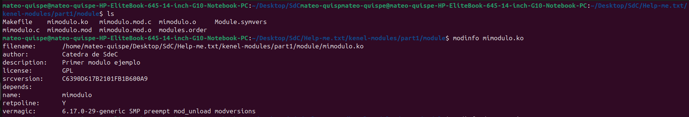
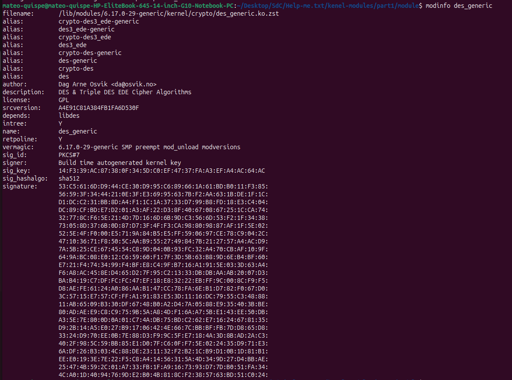
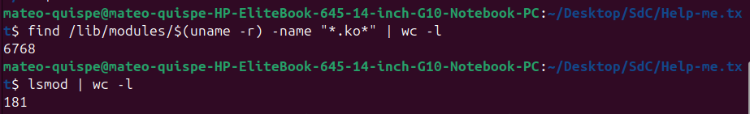
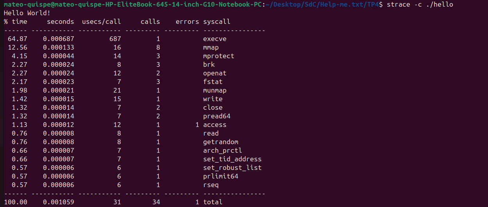
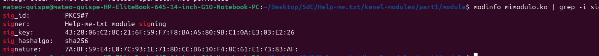
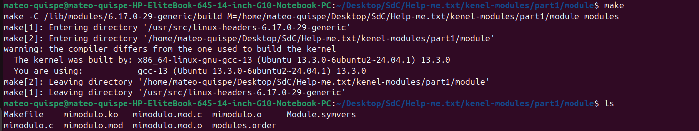
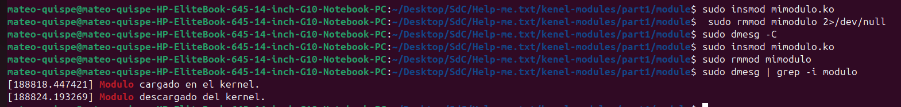

# Informe TP4 — Módulos de Kernel de Linux

### Help-me.txt
Integrantes:
- Mauro Cabero
- Nicolas de la Mata
- Mateo Quispe

Enlace al repositorio en github: https://github.com/Tuteku/Help-me.txt

## Introducción

El objetivo de este trabajo práctico es comprender qué es un módulo de kernel en Linux, cómo se diferencia de un programa de espacio de usuario, y aprender a compilarlo, cargarlo, descargarlo y firmarlo. Los módulos son fragmentos de código objeto que se cargan dinámicamente dentro del kernel para extender su funcionalidad sin necesidad de reiniciar el sistema. El caso más común es el de los *device drivers*, que le dan al kernel la capacidad de interactuar con un hardware específico.

La alternativa a los módulos es un **kernel monolítico**, donde toda la funcionalidad se compila en una sola imagen. Esto produce un kernel más grande, menos flexible y obliga a recompilar y reiniciar cada vez que se quiere agregar soporte para un dispositivo nuevo. Por eso Linux adopta una arquitectura modular (kernel híbrido).

## Preparación

Antes de comenzar instalamos las dependencias necesarias para compilar módulos fuera del árbol del kernel (out-of-tree) y clonamos el repositorio de prácticas:

```bash
sudo apt-get install build-essential checkinstall kernel-package linux-source
sudo apt-get install linux-headers-$(uname -r)
git clone https://gitlab.com/<usuario>/kenel-modules.git
cd kenel-modules/part1
```

`build-essential` provee `gcc`, `make` y la libc de desarrollo. `linux-headers-$(uname -r)` instala los headers del kernel en uso, indispensables porque un módulo se compila contra esa versión exacta (de lo contrario `insmod` falla con *invalid module format*).

---

## Desafío #1

### ¿Qué es checkinstall y para qué sirve?

`checkinstall` es una herramienta que reemplaza el clásico `make install` por una instalación rastreada a través del gestor de paquetes del sistema. En lugar de copiar archivos sueltos por `/usr/local/...` (que después son imposibles de desinstalar de forma limpia), `checkinstall`:

1. Ejecuta el `make install` dentro de un *sandbox* y registra qué archivos se crean.
2. Genera un paquete `.deb`, `.rpm` o Slackware con esos archivos.
3. Instala el paquete vía `dpkg`/`rpm`, dejando el software registrado en la base de paquetes.

La ventaja principal es la **trazabilidad**: en cualquier momento podemos hacer `dpkg -L paquete` para ver qué instaló y `sudo apt remove paquete` para desinstalarlo de forma limpia. Sin esto, el código compilado a mano queda "huérfano" en el sistema.

### Empaquetar un Hello World con checkinstall

Para probarlo escribimos un `hello.c` mínimo y un `Makefile` con regla `install`:

```c
// hello.c
#include <stdio.h>
int main(void) {
    printf("Hello World desde un paquete checkinstall\n");
    return 0;
}
```

```makefile
# Makefile
PREFIX ?= /usr/local
all: hello
hello: hello.c
	gcc -o hello hello.c
install: hello
	install -D -m 0755 hello $(DESTDIR)$(PREFIX)/bin/hello
clean:
	rm -f hello
```

Comandos:

```bash
make
sudo checkinstall --pkgname=hello-sdc --pkgversion=1.0 --default
```

Eso genera `hello-sdc_1.0-1_amd64.deb` y lo instala. Verificamos con:

```bash
dpkg -L hello-sdc        # archivos del paquete
which hello              # /usr/local/bin/hello
hello                    # ejecuta nuestro binario
sudo apt remove hello-sdc # desinstalación limpia
```

### Seguridad del kernel: firma de módulos y rootkits

Un **rootkit** es malware que se instala con los máximos privilegios del sistema (a nivel kernel) para ocultar su presencia y mantener acceso persistente. El vector clásico de un rootkit moderno es justamente **cargarse como módulo de kernel**: una vez insertado, puede hookear *syscalls*, ocultar procesos en `/proc`, esconder archivos a `ls`, e incluso enmascararse en `lsmod`. Como corre en *ring 0*, está por encima de cualquier antivirus de espacio de usuario.

La defensa principal del kernel contra esto es la **firma criptográfica de módulos**:

- El kernel se compila con la opción `CONFIG_MODULE_SIG` y opcionalmente `CONFIG_MODULE_SIG_FORCE`.
- Cada módulo se firma con una clave privada cuya pública está embebida en el kernel (o en el *MOK store* — Machine Owner Key).
- Al hacer `insmod`, el kernel verifica la firma. Si falta o no coincide, marca el kernel como *tainted* (`signature and/or required key missing - tainting kernel`) o directamente rechaza la carga.

Combinado con **Secure Boot** (UEFI verifica el bootloader → el bootloader verifica el kernel → el kernel verifica los módulos), se forma una cadena de confianza que dificulta enormemente que un rootkit no firmado consiga ejecución.

Mitigaciones complementarias:
- `kernel.modules_disabled=1` en sysctl: bloquea cualquier carga de módulos hasta el próximo reboot.
- `lockdown` mode (integridad/confidencialidad): restringe interfaces que permitirían modificar el kernel en caliente.
- IMA (Integrity Measurement Architecture) y `dm-verity` para validar la integridad del rootfs.

---

## Desafío #2

### ¿Qué funciones tiene disponible un programa y un módulo?

Un **programa de espacio de usuario** se enlaza contra la **libc** (glibc, musl, etc.) y por medio de ella accede a las *syscalls* del kernel (`open`, `read`, `write`, `mmap`, `brk`, etc.). Tiene disponible todo el ecosistema POSIX: `printf`, `malloc`, `fopen`, `pthread_create`, etc.

Un **módulo de kernel** **no** se enlaza contra la libc. Solamente puede usar funciones exportadas por el propio kernel (las que están marcadas con `EXPORT_SYMBOL` o `EXPORT_SYMBOL_GPL`). Por ejemplo:
- `printk()` en lugar de `printf()`.
- `kmalloc()`/`kfree()` en lugar de `malloc()`/`free()`.
- `copy_to_user()`/`copy_from_user()` para mover datos entre espacios.
- Macros de inicialización: `module_init()`, `module_exit()`.
- Macros de metadata: `MODULE_LICENSE`, `MODULE_AUTHOR`, `MODULE_DESCRIPTION`.

Se puede listar el universo disponible con `cat /proc/kallsyms` o consultando `Module.symvers`.

### Espacio de usuario vs. espacio de kernel

La CPU x86 implementa cuatro niveles de privilegio (anillos 0 a 3). Linux usa solamente dos:

| | Anillo | Privilegios | Acceso a HW | Memoria |
|---|---|---|---|---|
| **Espacio de kernel** | 0 | Total | Directo (I/O, MMU, interrupciones) | Toda la memoria física |
| **Espacio de usuario** | 3 | Restringido | Sólo vía syscalls | Memoria virtual propia (aislada por proceso) |

El cruce entre espacios se hace mediante una **syscall** (interrupción de software), que cambia el modo de la CPU y salta a un punto controlado del kernel. Esto da aislamiento: un puntero salvaje en un programa de usuario sólo rompe ese proceso, mientras que un puntero salvaje en un módulo puede tirar abajo el sistema entero.

### Espacio de datos

El **data space** de un programa de usuario está formado por el segmento de datos inicializados (`.data`), no inicializados (`.bss`), el heap y la pila, y vive dentro de la memoria virtual del proceso. Cada proceso tiene su propio mapa, gestionado por la MMU y descrito en `/proc/<pid>/maps`.

En el módulo de kernel no hay tal aislamiento: las variables globales del módulo viven en el espacio de direcciones del kernel, compartido con el resto del kernel y con todos los demás módulos. Por eso, al manejar datos provenientes del usuario hay que usar `copy_from_user()`/`copy_to_user()` y nunca desreferenciar directamente un puntero proveniente de userspace (sería una vulnerabilidad de tipo *arbitrary read/write*).

### Drivers y contenido de /dev

Un *driver* es el código que media entre el kernel y un dispositivo (físico o virtual) y lo expone al userspace como un archivo especial en `/dev`. La primera letra de `ls -l` indica el tipo:

- **Block devices** (`b`): acceso por bloques, p. ej. en nuestra PC `/dev/nvme0n1` (el SSD) y `/dev/loop0..31` (loopback que usa Ubuntu para montar los *snaps*).
- **Character devices** (`c`): acceso por flujo de bytes, p. ej. `/dev/null`, `/dev/random`, `/dev/fb0`.

Donde un archivo normal muestra el tamaño, un device muestra dos números **major, minor**: el *major* identifica al **driver** (en nuestra salida todos los `loop` comparten el major `7` y las particiones NVMe el `259`) y el *minor* a la **instancia** concreta (`nvme0n1` vs. su partición `nvme0n1p1`). En sistemas modernos `/dev` lo puebla dinámicamente `udev` cuando el kernel carga un driver. El subdirectorio `/dev/block/` confirma la idea: son symlinks nombrados `major:minor` que apuntan al nodo real (ej. `259:0 -> ../nvme0n1`), evidenciando que lo que identifica unívocamente al dispositivo y a su driver es ese par numérico, no el nombre legible.


---

## Pasos: ciclo de vida del módulo

Posicionados en `part1/` ejecutamos el ciclo completo:

```bash
cd part1
make
sudo insmod mimodulo.ko
sudo dmesg | tail
lsmod | grep mimodulo
```

Salida esperada en `dmesg`:

```
[67375.506122] mimodulo: loading out-of-tree module taints kernel.
[67375.506166] mimodulo: module verification failed: signature and/or required key missing - tainting kernel
[67375.506348] Modulo cargado en el kernel.
```

El primer mensaje (`taints kernel`) indica que el módulo no forma parte del árbol oficial del kernel. El segundo (`module verification failed`) aparece porque el módulo no está firmado: el kernel lo carga igual, pero deja una marca de *taint*. El tercero es el `printk()` que pusimos en la función `module_init`.

Descarga:

```bash
sudo rmmod mimodulo
sudo dmesg | tail
lsmod | grep mimodulo   # ya no aparece
cat /proc/modules | grep mimodulo
```

Mientras está cargado, `/proc/modules` muestra:

```
mimodulo 16384 0 - Live 0xffffffffc097e000 (OE)
```

Donde `16384` es el tamaño en bytes, `0` el contador de uso, `Live` el estado, `0xffffffffc097e000` la dirección base en memoria del kernel y las flags `OE` significan **O**ut-of-tree y **E**xperimental/unsigned.

---

## Preguntas

### 1. Diferencias entre los dos `modinfo`

Ejecutamos:

```bash
modinfo mimodulo.ko
modinfo des_generic   # equivale a /lib/modules/$(uname -r)/kernel/crypto/des_generic.ko.zst
```

En nuestro kernel los módulos del sistema vienen **comprimidos** (`des_generic.ko.zst`), por eso usamos el nombre del módulo y dejamos que `modinfo` resuelva la ruta y la descompresión.

Salida de nuestro módulo:

```
$ modinfo mimodulo.ko
filename:       /home/mateo-quispe/Desktop/SdC/Help-me.txt/kenel-modules/part1/module/mimodulo.ko
author:         Catedra de SdeC
description:    Primer modulo ejemplo
license:        GPL
srcversion:     C6390D617B2101FB1B600A9
depends:
name:           mimodulo
retpoline:      Y
vermagic:       6.17.0-29-generic SMP preempt mod_unload modversions
```



Salida del módulo del sistema (recortada en la firma):

```
$ modinfo des_generic
filename:       /lib/modules/6.17.0-29-generic/kernel/crypto/des_generic.ko.zst
alias:          crypto-des3_ede-generic
alias:          des3_ede-generic
alias:          crypto-des3_ede
alias:          des3_ede
alias:          crypto-des-generic
alias:          des-generic
alias:          crypto-des
alias:          des
author:         Dag Arne Osvik <da@osvik.no>
description:    DES & Triple DES EDE Cipher Algorithms
license:        GPL
srcversion:     A4E91C81A384FB1FA6D530F
depends:        libdes
intree:         Y
name:           des_generic
retpoline:      Y
vermagic:       6.17.0-29-generic SMP preempt mod_unload modversions
sig_id:         PKCS#7
signer:         Build time autogenerated kernel key
sig_key:        14:F3:39:AC:87:38:0F:34:5D:C0:EF:47:37:FA:A3:EF:A4:AC:64:AC
sig_hashalgo:   sha512
signature:      53:C5:61:6D:D9:44:CE:30:...   (256 bytes, recortado)
```



Diferencias observadas (sobre nuestra salida real):

| Campo | `mimodulo.ko` | `des_generic` |
|---|---|---|
| `filename` | Ruta local donde compilamos (`.../part1/module/mimodulo.ko`) | Ruta canónica bajo `/lib/modules/.../kernel/crypto/` y **comprimido** (`.ko.zst`) |
| `intree` | **No aparece** → es *out-of-tree*  | `Y` → forma parte del árbol oficial del kernel |
| `signature` / `sig_id` / `signer` / `sig_key` / `sig_hashalgo` | **Ausentes**: módulo sin firmar | Presentes: firmado `PKCS#7`, hash **SHA-512**, firmante *Build time autogenerated kernel key* |
| `alias` | No tiene ninguno | 8 alias (`des`, `des3_ede`, `crypto-des`, …) para que el subsistema `crypto-api` lo invoque por nombre |
| `depends` | Vacío | Depende de `libdes` |
| `author` / `description` | Genéricos de la cátedra | Autor real (Dag Arne Osvik) y descripción del algoritmo |
| `srcversion` | `C6390D617B2101FB1B600A9` (nuestro build) | `A4E91C81A384FB1FA6D530F` (build oficial) |
| `license` | `GPL` | `GPL` (igual en ambos) |
| `vermagic` | `6.17.0-29-generic SMP preempt mod_unload modversions` | **Idéntico** (forzosamente: si no coincide con `uname -r`, no carga) |
| `retpoline` | `Y` | `Y` (igual en ambos) |

Conclusión: el módulo del sistema viene **firmado (SHA-512), dentro del árbol del kernel (`intree: Y`), con alias y dependencias declaradas y metadata completa**; el nuestro está fuera del árbol, sin firma y con lo mínimo.

### 2. Módulos cargados en cada PC del grupo

Cada integrante corrió `lsmod` en su propia máquina y subió la salida al repo. Los archivos están en [`TP4/comparativa/`](comparativa/):

```bash
lsmod > lsmod-<nombre>.txt
```

| PC | Equipo | Plataforma | Módulos cargados |
|---|---|---|---|
| **Mateo** | HP EliteBook 645 G10 | AMD (hardware real) | 180 |
| **Mauro** | VirtualBox | x86 virtualizado | 68 |
| **Nicolas** | Lenovo IdeaPad | Intel + NVIDIA (hardware real) | 152 |

El conteo ya marca la primera diferencia: las dos PCs reales cargan 2–3× más módulos que la VM, porque tienen que manejar hardware concreto (GPU, wifi, bluetooth, sensores, lector de tarjetas) que en la VM simplemente no existe.

#### El diff

Las columnas `Size` y `Used by` cambian entre kernels aunque el módulo sea el mismo. Por eso normalizamos a **solo el nombre del módulo, ordenado**, y ahí sí el diff muestra: qué driver tiene cada uno que los demás no. Los diffs completos quedaron en [`comparativa/diff-mateo-mauro.txt`](comparativa/diff-mateo-mauro.txt) y [`comparativa/diff-mateo-nicolas.txt`](comparativa/diff-mateo-nicolas.txt), generados así:

```bash
norm() { awk 'NF>=3 && $2 ~ /^[0-9]+$/ {print $1}' "$1" | sort -u; }
norm lsmod-mateo.txt > modulos-mateo.txt   # idem mauro y nicolas
diff modulos-mateo.txt modulos-nicolas.txt
diff modulos-mateo.txt modulos-mauro.txt
```

De los módulos cargados, **37 son comunes a las tres PCs**: son la infraestructura básica del kernel, independiente del hardware (`snd_seq`, `snd_pcm`, `soundcore`, `hid`, `parport`, `x_tables`, `ip_tables`, `autofs4`, `intel_rapl_*`, `serio_raw`, etc.). El resto es lo que diferencia a cada equipo:

**Solo en Mateo (HP EliteBook, AMD):**
- GPU AMD: `amdgpu`, `amdxcp`, `drm_buddy`, `drm_suballoc_helper`.
- CPU/plataforma AMD: `kvm_amd`, `ccp`, `amd_pmc`, `amd_atl`, `k10temp`, `edac_mce_amd`.
- WiFi Realtek RTL8852CE: `rtw89_8852ce`, `rtw89_8852c`, `rtw89_pci`, `rtw89_core`, `mac80211`, `libarc4`.
- Audio AMD SOF: toda la familia `snd_sof_amd_*`, `snd_acp_*`, `soundwire_*`.
- Almacenamiento NVMe: `nvme`, `nvme_core`, `nvme_auth`, `nvme_keyring`.
- Plataforma HP / USB4: `hp_wmi`, `wireless_hotkey`, `thunderbolt`, `typec`, `typec_ucsi`, `xhci_pci_renesas`.
- Contenedores/Docker: `veth`, `xt_nat`, `nf_conntrack_netlink` (sumados a `overlay`, `bridge`, `vxlan` que también tiene cargados).

**Solo en Mauro (VirtualBox):**
- Drivers del *guest* de VirtualBox: `vboxguest`, `vboxvideo`.
- Hardware **emulado** por el hipervisor: `e1000` (placa de red Intel emulada), `snd_intel8x0` + `snd_ac97_codec` (placa de sonido emulada), `ahci` + `pata_acpi` (controladoras de disco emuladas), `vmwgfx` / `drm_vram_helper` (GPU virtual).
- `pstore_blk`, `pstore_zone`, `ramoops`, `reed_solomon`.


**Solo en Nicolas (Lenovo IdeaPad, Intel + NVIDIA):**
- GPU híbrida: `i915` (Intel integrada) **y** `nouveau` (driver libre de NVIDIA) + `mxm_wmi`, `drm_gpuvm`.
- WiFi Broadcom propietario: `wl` (nótese que usa `cfg80211` pero **no** `mac80211`, a diferencia del Realtek de Mateo).
- Plataforma Lenovo/Intel: `ideapad_laptop`, `mei_*` (Intel Management Engine), `coretemp`, `x86_pkg_temp_thermal`, `intel_cstate`, `lpc_ich`.
- Lector de tarjetas SD: `rtsx_pci`, `rtsx_pci_sdmmc`.
- Flash SPI: `spi_nor`, `spi_intel`, `mtd`, `cmdlinepart`.
- Firewall activo con reglas cargadas: `xt_LOG`, `ipt_REJECT`, `ip6t_REJECT`, `xt_limit`, `xt_hl`, `nft_limit`, `nf_log_syslog`, `nf_reject_ipv4/ipv6`.

#### Explicación de las diferencias

Una de las diferencias:

**Máquina virtual vs. hardware real.** El caso de la VirtualBox no le pasa el hardware real del host, sino dispositivos **emulados genéricos** (`e1000`, `snd_intel8x0`, `ahci`). Por eso su lista es corta y "neutra": no aparece ninguna GPU/wifi/bluetooth real, y en cambio aparecen los drivers `vbox*` del guest. Su PC no ve la placa real, ve la que el hipervisor le inventa.

### 3. Módulos disponibles pero no cargados

Los módulos disponibles en disco están en `/lib/modules/$(uname -r)/`. Para listarlos:

```bash
find /lib/modules/$(uname -r) -name "*.ko*" | wc -l   # cuántos hay disponibles
lsmod | wc -l                                          # cuántos están cargados
```


La diferencia son módulos que existen pero el sistema **no los cargó** porque el hardware o subsistema asociado no está en uso.

**Qué pasa si el driver de un dispositivo no está disponible:** el kernel detecta el hardware, pero al no encontrar driver compatible no expone ningún nodo en `/dev` ni interfaz en `/sys/class`. El dispositivo queda inaccesible. La solución habitual es buscar el módulo apropiado, instalarlo desde repositorios o compilarlo a partir de la fuente.

### 4. Salida de `hwinfo` en hardware real

`hwinfo` es una herramienta que detalla absolutamente todo el hardware detectado: CPU, memoria, buses PCI/USB, almacenamiento, periféricos.

```bash
sudo hwinfo --short
sudo hwinfo > hwinfo-<nombre>.txt
```

Subimos la salida al repo y referenciamos la URL aquí:

- [Abrir archivo](hwinfo-Help-me.txt)

### 5. Diferencia entre módulo y programa

| | Programa de usuario | Módulo de kernel |
|---|---|---|
| **Anillo de privilegio** | 3 (restringido) | 0 (total) |
| **Punto de entrada** | `main()` | `module_init()` (registrada con la macro) |
| **Punto de salida** | `return` / `exit()` | `module_exit()` |
| **Librería estándar** | libc disponible | No hay libc; solo símbolos exportados del kernel |
| **Espacio de memoria** | Virtual, aislado por proceso | Compartido con todo el kernel |
| **I/O** | Vía syscalls | Acceso directo a hardware |
| **Errores graves** | Segfault → el proceso muere | Oops/panic → puede tirar el sistema |
| **Linkeo** | Dinámico contra `.so` | Resolución de símbolos contra `vmlinux`/otros módulos al cargar |
| **Vida** | Mientras corra el proceso | Hasta `rmmod` o reboot |

Un programa "pide" cosas al kernel; un módulo **es** parte del kernel.

### 6. Listar las syscalls de un Hello World

La herramienta estándar es `strace`. Compilamos un hello en C y lo trazamos:

```bash
gcc -o hello hello.c
strace ./hello
strace -c ./hello       # resumen con conteo por syscall
strace -o hello.trace ./hello   # vuelca la traza a un archivo
```



### 7. ¿Qué es un *segmentation fault*?

Es una falla de protección de memoria. La MMU dispara una excepción de página al detectar uno de estos casos:

- El proceso accede a una dirección virtual **no mapeada** en su espacio.
- Accede a una página con **permisos insuficientes**.
- Dereferencia un puntero **nulo** o inválido.

**Cómo lo maneja el kernel:** la excepción de página la atrapa el manejador de *page faults*. Si el acceso era legítimo (página *swappeada*, *copy-on-write*, *demand paging*) el kernel resuelve y devuelve el control. Si no, el kernel envía la señal `SIGSEGV` al proceso ofensor.

**Cómo lo maneja el programa:** por defecto, `SIGSEGV` tiene como acción terminar el proceso y generar un *core dump*.
Si la misma falla ocurriera dentro de un módulo de kernel, el kernel genera un **Oops**. Dependiendo de la gravedad, el sistema sigue funcionando con el subsistema afectado roto o se cuelga.

### 8. Firmar un módulo de kernel

El proceso es:

```bash
# 1. Generar par de claves x509 para firmar módulos
openssl req -new -x509 -newkey rsa:2048 -keyout MOK.key -outform DER -out MOK.der -nodes -days 36500 -subj "/CN=Help-me-txt module signing/"

# 2. Inscribir la clave pública en el MOK (Machine Owner Key) del firmware
sudo mokutil --import MOK.der
# pide contraseña; al próximo reboot UEFI muestra MOKManager para confirmar

# 3. Firmar el módulo con sign-file (viene con linux-headers o kernel-source)
sudo /usr/src/linux-headers-$(uname -r)/scripts/sign-file sha256 MOK.key MOK.der mimodulo.ko

# 4. Cargar
sudo insmod mimodulo.ko
sudo dmesg | tail   # ya NO debe aparecer "module verification failed"
```

Verificamos que la firma quedó embebida en el `.ko` con `modinfo` (estos campos **no** aparecían antes de firmar, ver pregunta 1):

```bash
modinfo mimodulo.ko | grep -i sig
```

```
sig_id:         PKCS#7
signer:         Help-me-txt module signing
sig_key:        43:28:06:C2:8C:21:6F:59:F7:F8:BA:A5:80:9B:C1:0A:E3:03:E2:26
sig_hashalgo:   sha256
signature:      7A:BF:59:E4:E0:7C:93:1E:71:8D:CC:D6:10:F4:8C:61:E1:73:83:AF: ...
```

El `signer: Help-me-txt module signing` coincide con el `CN` del certificado que generamos en el paso 1, lo que confirma que el módulo fue firmado con nuestra propia clave.



### 9. Evidencia de compilación, carga y descarga propias

El módulo (`mimodulo.c`) define una función de carga y otra de descarga, cada una con un `printk` que deja constancia en el log del kernel:

```c
#include <linux/module.h>   /* Requerido por todos los módulos */
#include <linux/kernel.h>   /* Definición de KERN_INFO */

MODULE_LICENSE("GPL");
MODULE_DESCRIPTION("Primer modulo ejemplo");
MODULE_AUTHOR("Catedra de SdeC");

/* Se invoca al cargar el módulo en el kernel */
int modulo_lin_init(void)
{
    printk(KERN_INFO "Modulo cargado en el kernel.\n");
    return 0;   /* 0 = carga correcta */
}

/* Se invoca al descargar el módulo del kernel */
void modulo_lin_clean(void)
{
    printk(KERN_INFO "Modulo descargado del kernel.\n");
}

module_init(modulo_lin_init);
module_exit(modulo_lin_clean);
```

**Compilación:**

```bash
make        # compila el módulo contra los headers del kernel en uso
ls          # se verifica que se generó mimodulo.ko
```



**Carga y descarga:** limpiamos el buffer del kernel antes de cargar, para que los mensajes de nuestro módulo no queden mezclados con el ruido de auditoría de apparmor del sistema:

```bash
sudo rmmod mimodulo 2>/dev/null   # por si quedó cargado de una prueba anterior
sudo dmesg -C                     # vacía el buffer de mensajes del kernel
sudo insmod mimodulo.ko           # carga el módulo
lsmod | grep mimodulo             # confirma que está cargado
sudo rmmod mimodulo               # lo descarga
sudo dmesg | grep -i modulo       # filtra solo los mensajes de nuestro módulo
```

Salida obtenida:

```
[188818.447421] Modulo cargado en el kernel.
[188824.193269] Modulo descargado del kernel.
```

El primer `printk` corresponde a `module_init` (carga) y el segundo a `module_exit` (descarga): se evidencia el ciclo de vida completo del módulo propio.




### 10. Análisis del parche de Microsoft (Ars Technica)

**a) ¿Cuál fue la consecuencia principal del parche de Microsoft sobre GRUB en sistemas con arranque dual (Linux y Windows)?**

El problema es que ese parche terminó revocando la confianza en versiones de GRUB que un montón de distros de Linux seguían usando. Entonces el usuario actualizaba Windows pensando que era un update normal y, al reiniciar, el firmware UEFI ya no aceptaba a GRUB: la máquina arrancaba derecho a Windows o directamente tiraba el error de violación de Secure Boot, y Linux quedaba inarrancable. Lo llamativo es que el sistema Linux no se tocó en ningún momento, igual quedó inservible. Le pasó a usuarios de Ubuntu, Debian, Mint, Zorin y varias más, así que el impacto fue grande.

**b) ¿Qué implicancia tiene desactivar Secure Boot como solución al problema descrito?**

Apagar Secure Boot volvés a poder bootear Linux, pero en realidad rompés toda la cadena de confianza del arranque. En concreto:

- El firmware deja de chequear la firma del bootloader y del kernel, así que se abre la puerta a *bootkits* que corran incluso antes que el SO.
- Cualquier módulo de kernel se puede cargar, esté firmado o no, lo que incluye posibles rootkits.

**c) ¿Cuál es el propósito principal del Secure Boot en el proceso de arranque?**

La idea de Secure Boot es asegurarse de que todo lo que se ejecuta *antes* de que arranque el sistema operativo sea de confianza y no haya sido manipulado. Funciona como una cadena de verificaciones criptográficas: el firmware solo deja correr binarios cuya firma digital esté hecha con una clave que figure en su base `db`, y siempre que esa firma no esté en la lista negra `dbx` de cosas revocadas.

---

## Conclusiones

Trabajar con módulos de kernel nos obligó a movernos del modelo cómodo de "programa con libc" a uno donde no hay red de contención: cualquier error se paga con un Oops o un reboot. Esa diferencia explica por qué Linux distingue tan estrictamente entre espacio de usuario y de kernel, y por qué mecanismos como la firma de módulos y Secure Boot son centrales para mantener la integridad del sistema. El incidente del parche de Microsoft de 2024 deja en evidencia que esa cadena de confianza, cuando se rompe por un actor con privilegios de actualización, puede dejar inutilizables sistemas enteros — y que la "solución fácil" de desactivar Secure Boot tiene un costo real en seguridad.
