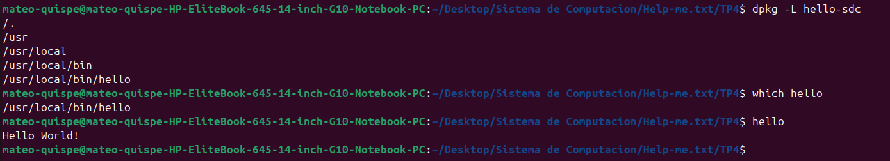
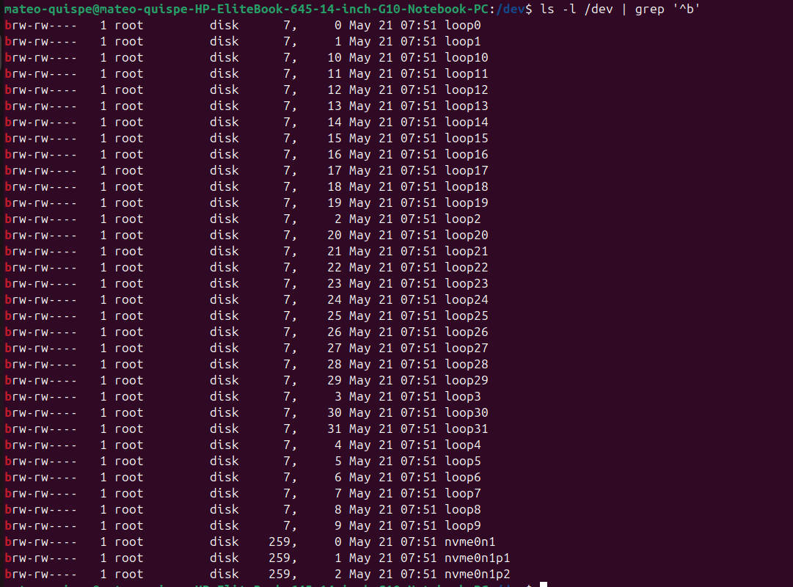

# Informe TP4 — Módulos de Kernel de Linux

### Help-me.txt
Integrantes:
- Mauro Cabero
- Nicolas de la Mata
- Mateo Quispe

Enlace al repositorio en github: https://github.com/Tuteku/Help-me.txt

## Introducción

El objetivo de este trabajo práctico es comprender qué es un módulo de kernel en Linux, cómo se diferencia de un programa de espacio de usuario, y aprender a compilarlo, cargarlo, descargarlo y firmarlo. Los módulos son fragmentos de código objeto que se cargan dinámicamente dentro del kernel para extender su funcionalidad sin necesidad de reiniciar el sistema. El caso más común es el de los *device drivers*, que le dan al kernel la capacidad de interactuar con un hardware específico.

La alternativa a los módulos es un **kernel monolítico**, donde toda la funcionalidad se compila en una sola imagen. Esto produce un kernel más grande, menos flexible y obliga a recompilar y reiniciar cada vez que se quiere agregar soporte para un dispositivo nuevo. Por eso Linux adopta una arquitectura modular (kernel híbrido).

## Preparación

Antes de comenzar instalamos las dependencias necesarias para compilar módulos fuera del árbol del kernel (out-of-tree) y clonamos el repositorio de prácticas:

```bash
sudo apt-get install build-essential checkinstall kernel-package linux-source
sudo apt-get install linux-headers-$(uname -r)
git clone https://gitlab.com/<usuario>/kenel-modules.git
cd kenel-modules/part1
```

`build-essential` provee `gcc`, `make` y la libc de desarrollo. `linux-headers-$(uname -r)` instala los headers del kernel en uso, indispensables porque un módulo se compila contra esa versión exacta (de lo contrario `insmod` falla con *invalid module format*).

---

## Desafío #1

### ¿Qué es checkinstall y para qué sirve?

`checkinstall` es una herramienta que reemplaza el clásico `make install` por una instalación rastreada a través del gestor de paquetes del sistema. En lugar de copiar archivos sueltos por `/usr/local/...` (que después son imposibles de desinstalar de forma limpia), `checkinstall`:

1. Ejecuta el `make install` dentro de un *sandbox* y registra qué archivos se crean.
2. Genera un paquete `.deb`, `.rpm` o Slackware con esos archivos.
3. Instala el paquete vía `dpkg`/`rpm`, dejando el software registrado en la base de paquetes.

La ventaja principal es la **trazabilidad**: en cualquier momento podemos hacer `dpkg -L paquete` para ver qué instaló y `sudo apt remove paquete` para desinstalarlo de forma limpia. Sin esto, el código compilado a mano queda "huérfano" en el sistema.

### Empaquetar un Hello World con checkinstall

Para probarlo escribimos un `hello.c` mínimo y un `Makefile` con regla `install`:

```c
// hello.c
#include <stdio.h>
int main(void) {
    printf("Hello World desde un paquete checkinstall\n");
    return 0;
}
```

```makefile
# Makefile
PREFIX ?= /usr/local
all: hello
hello: hello.c
	gcc -o hello hello.c
install: hello
	install -D -m 0755 hello $(DESTDIR)$(PREFIX)/bin/hello
clean:
	rm -f hello
```

Comandos:

```bash
make
sudo checkinstall --pkgname=hello-sdc --pkgversion=1.0 --default
```

Eso genera `hello-sdc_1.0-1_amd64.deb` y lo instala. Verificamos con:

```bash
dpkg -L hello-sdc        # archivos del paquete
which hello              # /usr/local/bin/hello
hello                    # ejecuta nuestro binario
sudo apt remove hello-sdc # desinstalación limpia
```

### Seguridad del kernel: firma de módulos y rootkits

Un **rootkit** es malware que se instala con los máximos privilegios del sistema (a nivel kernel) para ocultar su presencia y mantener acceso persistente. El vector clásico de un rootkit moderno es justamente **cargarse como módulo de kernel**: una vez insertado, puede hookear *syscalls*, ocultar procesos en `/proc`, esconder archivos a `ls`, e incluso enmascararse en `lsmod`. Como corre en *ring 0*, está por encima de cualquier antivirus de espacio de usuario.

La defensa principal del kernel contra esto es la **firma criptográfica de módulos**:

- El kernel se compila con la opción `CONFIG_MODULE_SIG` y opcionalmente `CONFIG_MODULE_SIG_FORCE`.
- Cada módulo se firma con una clave privada cuya pública está embebida en el kernel (o en el *MOK store* — Machine Owner Key).
- Al hacer `insmod`, el kernel verifica la firma. Si falta o no coincide, marca el kernel como *tainted* (`signature and/or required key missing - tainting kernel`) o directamente rechaza la carga.

Combinado con **Secure Boot** (UEFI verifica el bootloader → el bootloader verifica el kernel → el kernel verifica los módulos), se forma una cadena de confianza que dificulta enormemente que un rootkit no firmado consiga ejecución.

Mitigaciones complementarias:
- `kernel.modules_disabled=1` en sysctl: bloquea cualquier carga de módulos hasta el próximo reboot.
- `lockdown` mode (integridad/confidencialidad): restringe interfaces que permitirían modificar el kernel en caliente.
- IMA (Integrity Measurement Architecture) y `dm-verity` para validar la integridad del rootfs.

---

## Desafío #2

### ¿Qué funciones tiene disponible un programa y un módulo?

Un **programa de espacio de usuario** se enlaza contra la **libc** (glibc, musl, etc.) y por medio de ella accede a las *syscalls* del kernel (`open`, `read`, `write`, `mmap`, `brk`, etc.). Tiene disponible todo el ecosistema POSIX: `printf`, `malloc`, `fopen`, `pthread_create`, etc.

Un **módulo de kernel** **no** se enlaza contra la libc. Solamente puede usar funciones exportadas por el propio kernel (las que están marcadas con `EXPORT_SYMBOL` o `EXPORT_SYMBOL_GPL`). Por ejemplo:
- `printk()` en lugar de `printf()`.
- `kmalloc()`/`kfree()` en lugar de `malloc()`/`free()`.
- `copy_to_user()`/`copy_from_user()` para mover datos entre espacios.
- Macros de inicialización: `module_init()`, `module_exit()`.
- Macros de metadata: `MODULE_LICENSE`, `MODULE_AUTHOR`, `MODULE_DESCRIPTION`.

Se puede listar el universo disponible con `cat /proc/kallsyms` o consultando `Module.symvers`.

### Espacio de usuario vs. espacio de kernel

La CPU x86 implementa cuatro niveles de privilegio (anillos 0 a 3). Linux usa solamente dos:

| | Anillo | Privilegios | Acceso a HW | Memoria |
|---|---|---|---|---|
| **Espacio de kernel** | 0 | Total | Directo (I/O, MMU, interrupciones) | Toda la memoria física |
| **Espacio de usuario** | 3 | Restringido | Sólo vía syscalls | Memoria virtual propia (aislada por proceso) |

El cruce entre espacios se hace mediante una **syscall** (interrupción de software), que cambia el modo de la CPU y salta a un punto controlado del kernel. Esto da aislamiento: un puntero salvaje en un programa de usuario sólo rompe ese proceso, mientras que un puntero salvaje en un módulo puede tirar abajo el sistema entero.

### Espacio de datos

El **data space** de un programa de usuario está formado por el segmento de datos inicializados (`.data`), no inicializados (`.bss`), el heap y la pila, y vive dentro de la memoria virtual del proceso. Cada proceso tiene su propio mapa, gestionado por la MMU y descrito en `/proc/<pid>/maps`.

En el módulo de kernel no hay tal aislamiento: las variables globales del módulo viven en el espacio de direcciones del kernel, compartido con el resto del kernel y con todos los demás módulos. Por eso, al manejar datos provenientes del usuario hay que usar `copy_from_user()`/`copy_to_user()` y nunca desreferenciar directamente un puntero proveniente de userspace (sería una vulnerabilidad de tipo *arbitrary read/write*).

### Drivers y contenido de /dev

Un *driver* es el código que media entre el kernel y un dispositivo (físico o virtual) y lo expone al userspace como un archivo especial en `/dev`. La primera letra de `ls -l` indica el tipo:

- **Block devices** (`b`): acceso por bloques, p. ej. en nuestra PC `/dev/nvme0n1` (el SSD) y `/dev/loop0..31` (loopback que usa Ubuntu para montar los *snaps*).
- **Character devices** (`c`): acceso por flujo de bytes, p. ej. `/dev/null`, `/dev/random`, `/dev/fb0`.

Donde un archivo normal muestra el tamaño, un device muestra dos números **major, minor**: el *major* identifica al **driver** (en nuestra salida todos los `loop` comparten el major `7` y las particiones NVMe el `259`) y el *minor* a la **instancia** concreta (`nvme0n1` vs. su partición `nvme0n1p1`). En sistemas modernos `/dev` lo puebla dinámicamente `udev` cuando el kernel carga un driver. El subdirectorio `/dev/block/` confirma la idea: son symlinks nombrados `major:minor` que apuntan al nodo real (ej. `259:0 -> ../nvme0n1`), evidenciando que lo que identifica unívocamente al dispositivo y a su driver es ese par numérico, no el nombre legible.



---

## Pasos: ciclo de vida del módulo

Posicionados en `part1/` ejecutamos el ciclo completo:

```bash
cd part1
make
sudo insmod mimodulo.ko
sudo dmesg | tail
lsmod | grep mimodulo
```

Salida esperada en `dmesg`:

```
[67375.506122] mimodulo: loading out-of-tree module taints kernel.
[67375.506166] mimodulo: module verification failed: signature and/or required key missing - tainting kernel
[67375.506348] Modulo cargado en el kernel.
```

El primer mensaje (`taints kernel`) indica que el módulo no forma parte del árbol oficial del kernel. El segundo (`module verification failed`) aparece porque el módulo no está firmado: el kernel lo carga igual, pero deja una marca de *taint*. El tercero es el `printk()` que pusimos en la función `module_init`.

Descarga:

```bash
sudo rmmod mimodulo
sudo dmesg | tail
lsmod | grep mimodulo   # ya no aparece
cat /proc/modules | grep mimodulo
```

Mientras está cargado, `/proc/modules` muestra:

```
mimodulo 16384 0 - Live 0xffffffffc097e000 (OE)
```

Donde `16384` es el tamaño en bytes, `0` el contador de uso, `Live` el estado, `0xffffffffc097e000` la dirección base en memoria del kernel y las flags `OE` significan **O**ut-of-tree y **E**xperimental/unsigned.

---

## Preguntas

### 1. Diferencias entre los dos `modinfo`

Ejecutamos:

```bash
modinfo mimodulo.ko
modinfo /lib/modules/$(uname -r)/kernel/crypto/des_generic.ko
```

Diferencias observadas:

| Campo | `mimodulo.ko` | `des_generic.ko` |
|---|---|---|
| `filename` | Ruta local (donde compilamos) | Ruta canónica bajo `/lib/modules/.../kernel/crypto/` |
| `license` | La que pusimos en la macro (ej. GPL) | GPL (módulo oficial) |
| `signature` | Ausente | Presente, firmado por la clave del distribuidor |
| `sig_id` / `signer` / `sig_hashalgo` | No aparecen | `PKCS#7` con SHA-256 y firmante del kernel |
| `vermagic` | Coincide con `uname -r` | Idem (forzosamente, si no, no carga) |
| `depends` | Vacío | Puede declarar dependencias (otros módulos crypto) |
| `srcversion` | Generado por nuestro build | El del build oficial |
| `alias` | No tiene | Suele tener (para que el subsistema `crypto-api` lo invoque por nombre) |

Conclusión: el módulo del sistema viene **firmado, ubicado en el árbol oficial y con metadata completa**; el nuestro está fuera del árbol, sin firma, y solo declara lo mínimo.

### 2. Módulos cargados en cada PC del grupo *(PENDIENTE — tarea grupal)*

> **Esta parte requiere que cada integrante ejecute los comandos en su propia PC, suba la salida al repo y luego hagamos el diff.** Más abajo, en la sección "Trabajo grupal pendiente", se detalla qué tiene que correr cada uno.

### 3. Módulos disponibles pero no cargados

Los módulos disponibles en disco están en `/lib/modules/$(uname -r)/`. Para listarlos:

```bash
find /lib/modules/$(uname -r) -name "*.ko*" | wc -l   # cuántos hay disponibles
lsmod | wc -l                                          # cuántos están cargados
```

La diferencia (típicamente decenas de miles disponibles vs. ~150 cargados) son módulos que existen pero el sistema **no los cargó** porque el hardware o subsistema asociado no está en uso. Por ejemplo, `ntfs.ko` solo se carga si montamos una partición NTFS; `nouveau.ko` solo si hay GPU nvidia y no se está usando el driver propietario.

**Qué pasa si el driver de un dispositivo no está disponible:** el kernel detecta el hardware (lo vemos en `dmesg` o `lspci -v`), pero al no encontrar driver compatible no expone ningún nodo en `/dev` ni interfaz en `/sys/class`. El dispositivo queda inaccesible: una placa de red sin driver no aparece en `ip link`, un disco sin driver no se enumera en `/dev/`, etc. La solución habitual es buscar el módulo apropiado (`modprobe nombre`), instalarlo desde repositorios (`apt install firmware-...`) o compilarlo a partir del fuente.

### 4. Salida de `hwinfo` en hardware real

`hwinfo` es una herramienta que detalla absolutamente todo el hardware detectado: CPU, memoria, buses PCI/USB, almacenamiento, periféricos. Se instala con `sudo apt install hwinfo` y se corre, por ejemplo:

```bash
sudo hwinfo --short
sudo hwinfo > hwinfo-<nombre>.txt
```

Subimos la salida al repo y referenciamos la URL aquí:

- Mauro: *(pendiente — subir `hwinfo-mauro.txt`)*
- Nicolas: *(pendiente — subir `hwinfo-nicolas.txt`)*
- Mateo: *(pendiente — subir `hwinfo-mateo.txt`)*

### 5. Diferencia entre módulo y programa

| | Programa de usuario | Módulo de kernel |
|---|---|---|
| **Anillo de privilegio** | 3 (restringido) | 0 (total) |
| **Punto de entrada** | `main()` | `module_init()` (registrada con la macro) |
| **Punto de salida** | `return` / `exit()` | `module_exit()` |
| **Librería estándar** | libc disponible | No hay libc; solo símbolos exportados del kernel |
| **Espacio de memoria** | Virtual, aislado por proceso | Compartido con todo el kernel |
| **I/O** | Vía syscalls | Acceso directo a hardware |
| **Errores graves** | Segfault → el proceso muere | Oops/panic → puede tirar el sistema |
| **Linkeo** | Dinámico contra `.so` | Resolución de símbolos contra `vmlinux`/otros módulos al cargar |
| **Vida** | Mientras corra el proceso | Hasta `rmmod` o reboot |

Un programa "pide" cosas al kernel; un módulo **es** parte del kernel.

### 6. Listar las syscalls de un Hello World

La herramienta estándar es `strace`. Compilamos un hello en C y lo trazamos:

```bash
gcc -o hello hello.c
strace ./hello
strace -c ./hello       # resumen con conteo por syscall
strace -o hello.trace ./hello   # vuelca la traza a un archivo
```

Aunque el `main` solo hace un `printf`, `strace` revela una secuencia bastante más rica: `execve` (lo invoca el shell), `brk`, `mmap`, `access`, `openat` y `mmap` del enlazador para cargar `ld.so` y `libc.so`, `arch_prctl`, `set_tid_address`, `set_robust_list`, `rseq`, `prlimit64`, `newfstatat`, y recién entonces el `write(1, "Hello World\n", 12)` y el `exit_group(0)`. Esto evidencia todo el costo de arranque que la libc paga antes de ejecutar nuestra única línea útil.

### 7. ¿Qué es un *segmentation fault*?

Es una falla de protección de memoria. La MMU dispara una excepción de página al detectar uno de estos casos:

- El proceso accede a una dirección virtual **no mapeada** en su espacio.
- Accede a una página con **permisos insuficientes** (ej. escribir en una página de solo lectura, ejecutar en una página *NX*).
- Dereferencia un puntero **nulo** o inválido.

**Cómo lo maneja el kernel:** la excepción de página la atrapa el manejador de *page faults*. Si el acceso era legítimo (página *swappeada*, *copy-on-write*, *demand paging*) el kernel resuelve y devuelve el control. Si no, el kernel envía la señal `SIGSEGV` al proceso ofensor.

**Cómo lo maneja el programa:** por defecto, `SIGSEGV` tiene como acción terminar el proceso y generar un *core dump* (si `ulimit -c` lo permite). El programa puede registrar un handler con `signal()`/`sigaction()` para capturarla, pero hacerlo es delicado: lo recomendable es solo loguear y abortar, porque el estado interno tras un segfault es indefinido.

Si la misma falla ocurriera **dentro de un módulo de kernel**, no hay "proceso al que matar": el kernel genera un **Oops**. Dependiendo de la gravedad, el sistema sigue funcionando con el subsistema afectado roto, o entra en *kernel panic* y se cuelga.

### 8. Firmar un módulo de kernel

El proceso (siguiendo el link de askubuntu) es:

```bash
# 1. Generar par de claves x509 para firmar módulos
openssl req -new -x509 -newkey rsa:2048 -keyout MOK.key \
            -outform DER -out MOK.der -nodes -days 36500 \
            -subj "/CN=Help-me-txt module signing/"

# 2. Inscribir la clave pública en el MOK (Machine Owner Key) del firmware
sudo mokutil --import MOK.der
# pide contraseña; al próximo reboot UEFI muestra MOKManager para confirmar

# 3. Firmar el módulo con sign-file (viene con linux-headers o kernel-source)
sudo /usr/src/linux-headers-$(uname -r)/scripts/sign-file \
     sha256 MOK.key MOK.der mimodulo.ko

# 4. Cargar
sudo insmod mimodulo.ko
sudo dmesg | tail   # ya NO debe aparecer "module verification failed"
```

Una vez que el firmware acepta la clave (paso 2, vía MOKManager al rebootear), el kernel reconoce los módulos firmados con esa clave como confiables y no marca el kernel como tainted al cargarlos. La clave privada (`MOK.key`) debe quedar protegida (idealmente fuera del repo o cifrada): cualquiera con acceso a ella puede firmar módulos que esta máquina aceptará.

### 9. Evidencia de compilación, carga y descarga propias

Modificamos `mimodulo.c` para que el `printk` incluya el nombre del equipo:

```c
#include <linux/init.h>
#include <linux/module.h>
#include <linux/kernel.h>
#include <linux/utsname.h>

MODULE_LICENSE("GPL");
MODULE_AUTHOR("Help-me.txt - Cabero/de la Mata/Quispe");
MODULE_DESCRIPTION("Modulo demo TP4 SdC");

static int __init mimodulo_init(void) {
    printk(KERN_INFO "Help-me.txt: modulo cargado en %s\n",
           utsname()->nodename);
    return 0;
}

static void __exit mimodulo_exit(void) {
    printk(KERN_INFO "Help-me.txt: modulo descargado de %s\n",
           utsname()->nodename);
}

module_init(mimodulo_init);
module_exit(mimodulo_exit);
```

Ciclo de prueba:

```bash
make
sudo insmod mimodulo.ko
sudo dmesg | tail -n 5     # captura: "Help-me.txt: modulo cargado en <hostname>"
lsmod | grep mimodulo
sudo rmmod mimodulo
sudo dmesg | tail -n 5     # captura: "Help-me.txt: modulo descargado de <hostname>"
```

> **Cada integrante debe correr esto en su PC y agregar la captura de `dmesg` (con el hostname propio) al directorio `TP4/evidencia/`.**

### 10. Carga cruzada con Secure Boot *(PENDIENTE — tarea grupal)*

> **Esta es una prueba grupal: hay que tomar el `.ko` firmado por uno de los integrantes e intentar cargarlo en la PC de otro integrante que tenga Secure Boot habilitado.** Ver "Trabajo grupal pendiente" más abajo.

### 11. Análisis del parche de Microsoft (Ars Technica, agosto 2024)

**a) ¿Cuál fue la consecuencia principal del parche de Microsoft sobre GRUB en sistemas con arranque dual (Linux y Windows)?**

El parche `SBAT` (Secure Boot Advanced Targeting) que Microsoft empujó vía Windows Update — pensado para invalidar versiones vulnerables de bootloaders firmados — **revocó implícitamente la confianza en versiones de GRUB usadas por muchas distros de Linux**. En equipos con dual boot, al rebootear después del update de Windows, GRUB ya no era aceptado por el firmware UEFI bajo Secure Boot: el equipo arrancaba directamente a Windows o quedaba con la pantalla de violación de Secure Boot, dejando Linux inarrancable. La consecuencia práctica fue masiva: usuarios de Ubuntu, Debian, Linux Mint, Zorin y otras distros perdieron el acceso a su instalación de Linux sin haber tocado nada en ese sistema.

**b) ¿Qué implicancia tiene desactivar Secure Boot como solución al problema descrito?**

Desactivar Secure Boot desbloquea el arranque de Linux, pero **rompe la cadena de confianza** del sistema:

- El firmware deja de verificar la firma del bootloader y del kernel, lo que abre la puerta a *bootkits* que se ejecuten antes que el SO.
- Cualquier módulo de kernel — firmado o no — puede ser cargado, incluyendo rootkits.
- En Windows, deshabilitar Secure Boot puede invalidar funciones como BitLocker (que usa el TPM ligado al estado de Secure Boot) y obligar a reingresar la clave de recuperación.
- En entornos corporativos, viola políticas de compliance (la mayoría exigen Secure Boot encendido).

Es una solución **funcional pero degradada en seguridad**; la solución correcta era actualizar GRUB a una versión que el nuevo SBAT acepta.

**c) ¿Cuál es el propósito principal del Secure Boot en el proceso de arranque?**

Secure Boot es un mecanismo definido en UEFI cuyo objetivo es **garantizar la integridad y autenticidad del software que se ejecuta antes del sistema operativo**. Funciona como una cadena de verificación criptográfica: el firmware solo carga binarios (`bootloader`, `shim`, kernel) cuya firma digital esté hecha con una clave presente en la base de datos `db` del firmware, y que no figure en la lista de revocación `dbx`. De esta forma se previene que un atacante con acceso al almacenamiento (físico o vía malware) instale un *bootkit* o reemplace el cargador de arranque por uno comprometido: si lo hiciera, el firmware detectaría la firma inválida y se rehusaría a arrancar.

---

## Trabajo grupal pendiente

Estas son las partes que **no se pueden hacer solo** y que tenemos que coordinar entre los tres integrantes. Para cada una dejo qué hay que correr y qué tenemos que entregar:

### A. Pregunta 2 — Comparación de módulos cargados entre las PCs del grupo

**Cada integrante** corre en su propia PC:

```bash
lsmod > lsmod-<nombre>.txt
cat /proc/modules > procmodules-<nombre>.txt
uname -a > uname-<nombre>.txt
lscpu > lscpu-<nombre>.txt
```

Sube esos `.txt` a `TP4/comparativa/` en el repo. Después, en el informe (esta sección), hacemos los diffs:

```bash
diff lsmod-mauro.txt lsmod-nicolas.txt
diff lsmod-mauro.txt lsmod-mateo.txt
diff lsmod-nicolas.txt lsmod-mateo.txt
```

Y explicamos las diferencias: típicamente vienen de distinto hardware (drivers wifi/gpu distintos), distinta distro/kernel (`uname -r`), o software instalado que cargó módulos (VirtualBox carga `vboxdrv`, Docker carga `overlay`, etc.).

### B. Pregunta 10 — Carga cruzada de módulo firmado con Secure Boot

Esto es una **prueba experimental conjunta**. Pasos:

1. **Uno** de nosotros (ej. Mateo) firma su `mimodulo.ko` con su propio par de claves MOK (como en la pregunta 8).
2. **Otro** integrante (ej. Mauro o Nicolas) que tenga **Secure Boot habilitado** y **no haya importado** la clave de Mateo intenta cargar ese mismo `mimodulo.ko`:
   ```bash
   sudo insmod mimodulo.ko
   sudo dmesg | tail
   ```
3. El resultado esperado es que `insmod` falle con algo como:
   ```
   insmod: ERROR: could not insert module mimodulo.ko: Key was rejected by service
   ```
   y `dmesg` muestre `Loading of unsigned module is rejected` o `PKCS#7 signature not signed with a trusted key`.
4. Documentamos la captura de `dmesg` y explicamos por qué pasó: la clave pública de quien firmó **no está en el MOK store** de la otra máquina, así que Secure Boot rechaza el módulo aunque esté correctamente firmado. La cadena de confianza es por-máquina.

### C. Pregunta 4 — `hwinfo` en hardware real

Cada uno corre en su PC física (no en VM):

```bash
sudo apt install hwinfo
sudo hwinfo --short > hwinfo-<nombre>.txt
sudo hwinfo > hwinfo-<nombre>-completo.txt
```

Subimos los archivos al repo y referenciamos la URL en la pregunta 4 del informe.

### D. Pregunta 9 — Evidencia individual de carga/descarga

Cada uno corre el ciclo `make / insmod / dmesg / rmmod` con su hostname y aporta:
- Screenshot o `.txt` de `dmesg` mostrando el mensaje con el hostname propio.
- Archivo en `TP4/evidencia/dmesg-<nombre>.txt`.

### E. Coloquios grupales (Desafíos #1 y #2)

Los desafíos se evalúan en **coloquio oral grupal**, no por escrito. Lo que está en este informe son los apuntes para defender oralmente:
- Desafío #1: saber explicar checkinstall, mostrar el `.deb` empaquetado, y argumentar sobre firma de módulos y rootkits.
- Desafío #2: poder responder en vivo las cuatro preguntas (funciones disponibles, espacios de usuario/kernel, espacio de datos, drivers/`/dev`).

Conviene que cada uno repase todas las respuestas, porque en el coloquio le pueden preguntar a cualquiera.

---

## Conclusiones

Trabajar con módulos de kernel nos obligó a movernos del modelo cómodo de "programa con libc" a uno donde no hay red de contención: cualquier error se paga con un Oops o un reboot. Esa diferencia explica por qué Linux distingue tan estrictamente entre espacio de usuario y de kernel, y por qué mecanismos como la firma de módulos y Secure Boot son centrales para mantener la integridad del sistema. El incidente del parche de Microsoft de 2024 deja en evidencia que esa cadena de confianza, cuando se rompe por un actor con privilegios de actualización, puede dejar inutilizables sistemas enteros — y que la "solución fácil" de desactivar Secure Boot tiene un costo real en seguridad.
