# Informe TP5 — Módulos de Kernel de Linux

### Help-me.txt
Integrantes:
- Mauro Cabero
- Nicolas de la Mata
- Mateo Quispe

Enlace al repositorio en github: https://github.com/Tuteku/Help-me.txt
## Introduccion
Este trabajo práctico consiste en el diseño e implementación de un Character Device Driver (CDD) para el kernel de Linux que permita sensar dos señales externas con un período de muestreo de un segundo. Complementariamente, se desarrolla una aplicación de espacio de usuario capaz de leer una de las dos señales a través del CDD y graficarla en función del tiempo.

El desarrollo sigue un flujo de compilación cruzada (cross-compilation): el código se escribe y compila en una PC host (x86_64) apuntando a la arquitectura ARM de la Raspberry Pi, y los binarios resultantes se transfieren vía SSH. La visualización se realiza mediante una interfaz web servida desde la propia RPi, accesible desde el navegador de la PC host.
## Marco Teórico
### Driver, Device Controller y Bus Driver
Estos tres conceptos suelen confundirse, pero ocupan lugares distintos en la jerarquía de hardware y software:
- Device Driver: es software que corre dentro del kernel. Sabe cómo controlar un tipo específico de dispositivo y expone una interfaz al espacio de usuario.
- Device Controller: es un componente de hardware (un chip o circuito integrado) que gestiona físicamente la comunicación con los dispositivos. Por ejemplo, el controlador USB de la Raspberry Pi es un chip que maneja el protocolo eléctrico USB. En un microcontrolador como los que usa la Raspberry Pi, varios controllers vienen integrados en el mismo chip (I2C, SPI, UART, GPIO).
- Bus Driver: es el software que le enseña al kernel cómo comunicarse con un device controller particular. Implementa el protocolo del bus (USB, I2C, SPI, PCI) y ofrece funciones que los device drivers de más arriba pueden usar. En nuestro caso, el bus driver del GPIO ya existe en el kernel de la Raspberry Pi; nosotros lo usamos pero no lo escribimos.

La jerarquía de capas queda así:

### Clasificación de drivers en Linux
Linux clasifica los dispositivos en tres verticales según cómo se transfieren los datos:
- Network (orientado a paquetes): tarjetas de red, wifi, bluetooth. Transmiten datos como paquetes con cabeceras y protocolos.
- Storage/Block (orientado a bloques): discos duros, pendrives, tarjetas SD. Los datos se leen y escriben en bloques de tamaño fijo (típicamente 512 bytes o 4 KB).
- Character (orientado a bytes): puertos serie, teclados, ratones, sensores, cámaras, audio. Los datos se transfieren byte a byte, sin estructura de bloque. Este es el grupo mayoritario, y es donde se ubica nuestro driver.
### Character Device Driver

Un CDD en Linux se compone de los siguientes elementos:
- Módulo del kernel (.ko): el driver se empaqueta como un módulo cargable. Tiene un constructor (module_init) que se ejecuta al hacer insmod y un destructor (module_exit) que se ejecuta al hacer rmmod.
- Major y Minor numbers: el major number identifica qué driver maneja un dispositivo. El minor number distingue entre múltiples instancias del mismo driver. Juntos forman el par <major, minor> que el kernel usa para vincular un archivo de /dev/ con su driver correspondiente.
- Character Device File (CDF): es el archivo especial que aparece en /dev/ (por ejemplo /dev/signal_cdd). Las aplicaciones de usuario interactúan con este archivo usando las llamadas estándar de archivos.
- file_operations: es la estructura central del driver. Es una tabla que le dice al kernel qué función ejecutar cuando el usuario hace open(), read(), write() o close() sobre el archivo del dispositivo.
- Transferencia de datos: dado que el kernel y el espacio de usuario tienen espacios de memoria separados, se usan las funciones copy_to_user() (para read) y copy_from_user() (para write) para mover datos de forma segura entre ambos mundos.
### Compilación cruzada
La compilación cruzada (cross-compilation) consiste en compilar código en una máquina para que se ejecute en otra con arquitectura diferente. En nuestro caso el host es una PC x86_64 y el target es la Raspberry Pi con procesador ARM.

Para esto se necesitan dos elementos: un cross-compiler (gcc para ARM de 64 bits, aarch64-linux-gnu-gcc) y los headers del kernel que está corriendo en la Raspberry Pi. El Makefile invoca al sistema de build del kernel (kbuild) pasándole las variables ARCH y CROSS_COMPILE para que genere un .ko compatible con ARM.

El flujo de trabajo es:

                                          
### GPIO y señales digitales
Los pines GPIO de la Raspberry Pi operan con lógica de 3.3V. Cuando se configuran como entrada, leen HIGH (1) si la tensión supera ~1.8V, o LOW (0) si está por debajo.

Al conectar un generador de señales, la señal analógica queda digitalizada por este umbral. Dado que nuestro período de muestreo es de 1 segundo, la frecuencia de la señal debe ser menor a 0.5 Hz (criterio de Nyquist) para capturar correctamente las transiciones.

Los GPIO toleran un máximo de 3.3V. Se recomienda intercalar una resistencia de 1kΩ en serie como protección.

## Desarrollo

El desarrollo se dividió en dos grandes etapas: (1) la construcción y carga del Character Device Driver mediante compilación cruzada, y (2) la aplicación de usuario con visualización web. A continuación se documenta el flujo completo con las capturas de cada paso.

### 1. Entorno de compilación cruzada

El host es una PC x86_64 con Ubuntu 24.04 y el target una Raspberry Pi 5 (SoC BCM2712, con los GPIO del header gestionados por el chip RP1) corriendo Raspberry Pi OS con kernel `6.12.25+rpt-rpi-2712` (aarch64).

Para cross-compilar un módulo de kernel no alcanza con un compilador y los headers sueltos: se necesita el **árbol del kernel exacto** del target. Los pasos de preparación fueron:

- Instalación del cross-compiler `aarch64-linux-gnu-gcc-12`. La versión 12 coincide con la que compiló el kernel de la Pi (registrada en `CONFIG_CC_VERSION_TEXT` del `.config`), evitando errores de `-Werror` por diferencias de versión.
- Instalación en la Pi de los headers (`linux-headers-rpi-2712` y su parte común) y copia de ese árbol a la PC, replicando la ruta `/usr/src/linux-headers-6.12.25+rpt-rpi-2712`.
- Los paquetes de headers de Debian/RPi traen sus herramientas internas de build (`fixdep`, `modpost`) compiladas para ARM64 y sin código fuente para recompilarlas en x86. Para ejecutarlas se usó `qemu-user-static` (emulación *user-mode* vía `binfmt_misc`), con la variable `QEMU_LD_PREFIX` apuntando al sysroot ARM64 del toolchain para resolver el cargador dinámico y la libc.

### 2. Compilación cruzada del módulo

Con el entorno listo, se compila el módulo con un Makefile *out-of-tree* que invoca a kbuild con `ARCH=arm64` y `CROSS_COMPILE=aarch64-linux-gnu-`:

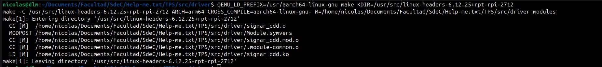

Se observan las etapas de kbuild: `CC [M]` compila `signar_cdd.o` (con el cross-gcc, nativo x86), `MODPOST` procesa los símbolos y el *version magic* (corriendo emulado bajo QEMU), y `LD [M]` enlaza el módulo final `signar_cdd.ko`.

El build genera el conjunto de artefactos en el directorio del driver:

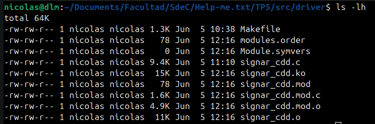

El archivo relevante es `signar_cdd.ko` (15 K), el módulo ARM64 listo para cargar. Su *vermagic* quedó en `6.12.25+rpt-rpi-2712 ... aarch64`, idéntico al del kernel de la Pi, lo que garantiza que `insmod` lo acepte sin rechazo.

### 3. Transferencia a la Raspberry Pi

El módulo se envía a la Pi por SSH con `scp`:

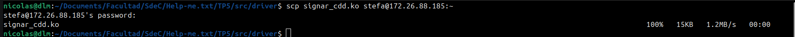

### 4. Carga del módulo en el kernel

En la Pi se inserta el módulo con `insmod` y se verifica en el log del kernel (`dmesg`):

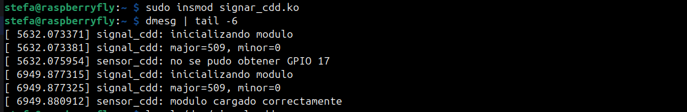

La captura documenta un detalle importante de la Raspberry Pi 5: el primer intento falló con `no se pudo obtener GPIO 17` (error `-EPROBE_DEFER`, 517). En la Pi 5 los pines del header cuelgan del chip **RP1** (`gpiochip0`), cuya base global **no es 0 sino 569**. La API legacy `gpio_request()` usa el número global = base + offset BCM, por lo que hubo que mapear **BCM17 → 586** y **BCM27 → 596**. Con esa corrección, el segundo intento muestra `modulo cargado correctamente` y se crea automáticamente el device `/dev/signal_cdd`.

### 5. Aplicación de usuario y servidor web

La aplicación `sensor_app.py` corre **en la Pi**: lee `/dev/signal_cdd` una vez por segundo y expone los datos por HTTP en el puerto 8080 (usa solo la biblioteca estándar de Python 3, sin dependencias). Como el device pertenece a root, se le dan permisos de lectura/escritura (`chmod 666`) antes de lanzar el servidor:

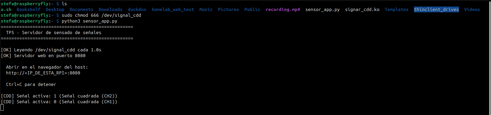

El servidor confirma que está leyendo el CDD cada 1 s y sirviendo la web; las líneas `[CDD] Señal activa` aparecen cuando, desde el navegador, se cambia de canal (la app escribe '0' o '1' al CDD).

### 6. Visualización web

Desde el navegador de la PC host se accede a `http://172.26.88.185:8080`. Al inicio, sin señal aplicada, el gráfico muestra el pin en 0 V (LOW):

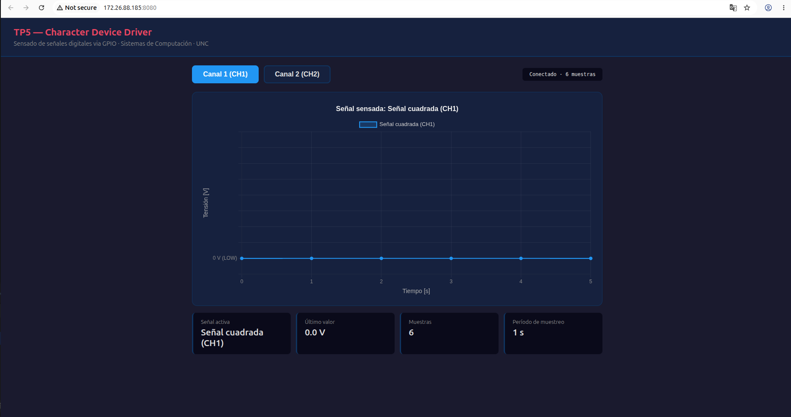

Conectando el generador al canal 1, se observa la señal cuadrada sensada en tiempo real (gráfico tipo escalera, con el eje en niveles 0 V / 3.3 V):

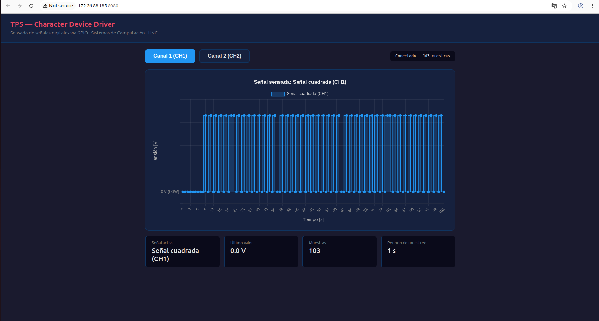

Al presionar el botón **Canal 2 (CH2)** —que dispara un POST al servidor y este escribe el carácter correspondiente al CDD— se cambia la señal activa del driver y se pasa a visualizar el segundo generador, con su propia cuadrada:

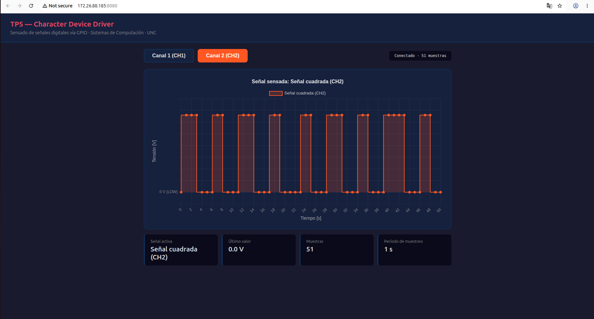

El driver, al recibir el cambio, actualiza la señal activa y resetea su buffer; la gráfica refleja el cambio de canal de inmediato.

### 7. Conexionado electrónico

Se utilizaron dos generadores de señales, uno por canal. Consideraciones de la conexión:

- **Pines:** las señales van a **BCM17 (pin físico 11)** y **BCM27 (pin físico 13)**; la masa de los generadores a un **GND común** de la Pi (p. ej. pin físico 6), imprescindible para tener una referencia válida.
- **Niveles:** los GPIO son entradas **digitales** de **3.3 V, no tolerantes a 5 V ni a tensiones negativas**. Cada generador se configuró como onda cuadrada entre 0 V y ~3.3 V (salida en modo alta impedancia para no duplicar la amplitud por el factor 50 Ω), con una resistencia de ~330 Ω en serie como protección.
- **Frecuencia:** como el muestreo es de 1 Hz, por Nyquist la señal debe ser < 0.5 Hz; se usaron frecuencias del orden de 0.1–0.25 Hz para observar las transiciones con claridad.

Dado que la entrada es digital, el GPIO solo distingue dos estados (0/1) según el umbral (~1.8 V): el eje "Tensión [V]" de la web es una reconstrucción a nivel de usuario (`valor × 3.3`), no una medición analógica.

## Análisis del driver

En esta sección se relacionan las partes del código del CDD con los conceptos teóricos del material de la cátedra, y se documentan las verificaciones realizadas sobre el dispositivo.

### Registro del `<major, minor>` y vínculo CDF↔CDD

Conectar el archivo de dispositivo (CDF) con el driver (CDD) se hace en dos pasos:

1. **Registrar el rango `<major, minor>`.** El driver usa `alloc_chrdev_region(&dev_num, 0, NUM_DEVICES, DEVICE_NAME)`, que reserva un major **dinámico** (el kernel elige uno libre) con minor base 0. La alternativa `register_chrdev_region` permite pedir un par fijo; se eligió la dinámica por ser la práctica recomendada. El par queda almacenado en una variable de tipo `dev_t`, de la que se extraen las cifras con las macros `MAJOR(dev_num)` y `MINOR(dev_num)` (de `<linux/kdev_t.h>`).
2. **Vincular las operaciones del CDF a las funciones del CDD.** Con `cdev_init(&signal_cdev, &fops)` se asocia la tabla `file_operations`, y con `cdev_add(&signal_cdev, dev_num, NUM_DEVICES)` se publica el cdev en el kernel: a partir de ese momento un `open()` sobre el archivo asociado a `dev_num` entra a nuestras funciones.

Es importante el detalle que remarca la teoría: el vínculo **App↔CDF** se basa en el *nombre* del archivo, pero el vínculo **CDF↔CDD** se basa en el *número* `<major, minor>`, no en el nombre. Esto se verifica en la Pi:

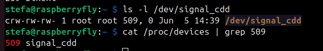

`ls -l` muestra `crw-rw-rw- ... 509, 0`: la `c` indica *character device*, y `509, 0` es el par `<major, minor>`. `cat /proc/devices | grep 509` confirma que el kernel registró el major **509** con el nombre `signal_cdd`. Que ambos coincidan prueba el enlace por número. El major es alto y dinámico (asignado por `alloc_chrdev_region`), y el minor es 0 porque se registró un único dispositivo (`NUM_DEVICES = 1`).

### Creación automática del Character Device File

Históricamente el CDF se creaba a mano con `mknod /dev/... c <major> <minor>`. El driver, en cambio, usa la creación automática: `class_create(CLASS_NAME)` crea una clase en sysfs y `device_create(signal_class, NULL, dev_num, NULL, DEVICE_NAME)` publica la información del dispositivo (incluido el `<major, minor>`) bajo `/sys/class`. El demonio **udev** lee esa información y crea solo el archivo `/dev/signal_cdd`. Esto se puede comprobar por sysfs con `cat /sys/class/signal_class/signal_cdd/dev`, que devuelve `509:0`. Las llamadas inversas (`device_destroy` y `class_destroy`) se invocan en orden cronológicamente inverso al descargar el módulo.

### Operaciones del `file_operations` y semántica de `read`/`write`

La tabla `fops` vincula las syscalls con las funciones del driver: `open→signal_open`, `read→signal_read`, `write→signal_write`, `release→signal_close`.

- **`open`/`release`** son triviales: solo registran un mensaje en el log y devuelven `0` (éxito).
- **`read` y `write` devuelven `ssize_t`** (palabra con signo): un valor **negativo** indica error (p. ej. `-EFAULT`), y uno **positivo** es la cantidad de bytes transferidos. En `signal_read` se formatea el valor lógico como `"0\n"`/`"1\n"`, se copia a espacio de usuario con `copy_to_user` y se devuelve la cantidad de bytes; el manejo de **EOF** se resuelve con `if (*offset > 0) return 0;`, que hace que una segunda lectura consecutiva devuelva 0 (fin de archivo) en lugar de repetir el dato. En `signal_write` se toma un byte con `copy_from_user`, se valida que sea `'0'` o `'1'` para seleccionar la señal activa, y se devuelve `len` (bytes consumidos).

Esto explica el comportamiento observado al probar con `cat` (lectura) y `echo` (escritura) sobre el device.

### Ciclo de vida del módulo: constructor y destructor

El kernel es, en esencia, una implementación orientada a objetos en C: cada driver tiene un **constructor** (`module_init` → `signal_init`, se ejecuta con `insmod`) y un **destructor** (`module_exit` → `signal_exit`, se ejecuta con `rmmod`). El destructor desmonta todo en orden inverso al montaje: `del_timer_sync` (espera a que termine cualquier callback en curso), `gpio_free` de ambos pines, `device_destroy`, `class_destroy`, `cdev_del`, `unregister_chrdev_region` y `kfree`. El ciclo completo se verifica en el log del kernel:

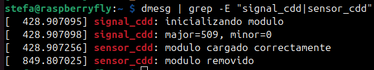

Se observan las cuatro etapas: inicialización, asignación del `<major, minor>` (509/0), `modulo cargado correctamente` (constructor, tras `insmod`) y `modulo removido` (destructor, tras `rmmod`). Luego de la descarga, `/dev/signal_cdd` desaparece y el major 509 se libera de `/proc/devices`, confirmando que la limpieza fue correcta.

## Conclusiones

Se implementó con éxito un Character Device Driver para Linux que sensa dos señales digitales por GPIO con período de muestreo de 1 segundo, junto con una aplicación de usuario que las sirve por una interfaz web. El driver se construyó por compilación cruzada desde una PC x86_64 hacia la arquitectura ARM64 de la Raspberry Pi 5 y se cargó vía SSH, validando todo el flujo de trabajo.

Los principales aprendizajes prácticos fueron: (a) la compilación cruzada de un módulo requiere el árbol del kernel exacto del target y la coincidencia del *version magic* y del compilador; (b) los paquetes de headers binarios obligaron a emular con QEMU las herramientas de build provistas solo para ARM64; y (c) la Raspberry Pi 5, al gestionar los GPIO mediante el chip RP1, reubica la base del *numberspace* global, lo que obligó a ajustar los números de pin de la API legacy para evitar el `-EPROBE_DEFER`.
